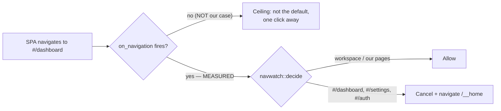

# D0 — SPIKE: navigation control

Gate: `scripts/d0-navigation-spike.sh` (`just d0`). Verdict doc:
[`docs/spikes/navigation-control.md`](../spikes/navigation-control.md). Not chained into
`just e2e` — per PLAN4's chaining rule, a pure-verdict spike that lands no product
behaviour change isn't added to the regression ladder (as E5/E6 in chapter 3 weren't).

## What changed

D0 answers a question chapter 4 could not proceed past without an answer: Penpot routes
between its dashboard, settings, auth, and workspace screens using the URL **fragment**
(everything after `#`), and a fragment never reaches the server — so the proxy, which
is how this project intercepts almost everything else, is blind to it. The only thing
that could possibly see a `#/dashboard` navigation happening is the webview itself. It
was genuinely unknown whether Tauri exposes that, and whether observing it could be
done without injecting anything into Penpot's own frontend (which the project's
invariant 3 forbids outright).

This milestone builds the smallest possible experiment to find out, and finds out: yes.
A same-document hash change **is** observed by Tauri's navigation callback, and a
policy hooked into that callback can cancel a navigation to a web-only route (
`#/dashboard`, `#/settings`, `#/auth`) and send the window to our own `/__home` page
instead — mid-session, without corrupting anything on disk. Both behaviours are
env-gated off by default, so this milestone changes **no user-visible behaviour** in a
normal run. What it changes is what's now known to be *possible*: D2's "boot into
`/__home`, never `/dashboard`" front door and D6's residue cleanup can both now target
"genuinely unreachable" rather than settling for "not the default." Full reasoning,
caveats, and the captured evidence live in the verdict doc linked above.

## How it works



Three pieces landed to make this measurable and, on GO, usable later:

- **`apps/desktop/src/navprobe.{rs,html}`** — a page we serve ourselves at
  `/__navprobe`, with three isolated navigation cases (hash change, `pushState`, full
  document navigation). Using our own page instead of Penpot's SPA keeps invariant 3
  out of the question entirely for the mechanism test.
- **`apps/desktop/src/navwatch.rs`** — the observer and policy. `NavWatch` hooks
  Tauri's `on_navigation` callback (which requires the window to now be built in Rust
  rather than declared in `tauri.conf.json`) and records every navigation it sees. The
  pure function `decide(url, redirect_enabled)` maps a URL to `Allow` or
  `CancelAndRedirect("/__home")` based on whether the fragment starts with
  `#/dashboard`, `#/settings`, or `#/auth`. Both switches
  (`PENPOT_LOCAL_NAVWATCH_LOG`, `PENPOT_LOCAL_NAVWATCH_REDIRECT`) are read from the
  environment and are off unless explicitly set.
- **`scripts/d0_navprobe.py`** and **`scripts/d0_penpot_nav.cjs`** — the gate's
  measurement tools: the first reads the JSONL the observer wrote to determine whether
  a case was actually observed; the second is a strictly read-only inspection of
  Penpot's real DOM (bundled offline Chromium) to check how Penpot itself links to its
  routes, kept deliberately separate so a false reading in either can't contaminate the
  other.

The gate (`scripts/d0-navigation-spike.sh`) chains six probe legs — full-document
control, the central hash-change measurement, the pushState fallback, the Penpot
anchor reality-check, a live redirect, and a vault-integrity check around that
redirect — and writes every result to `findings.json`. The controller ran the finished
gate twice: both runs exited 0, both printed `D0 NAVIGATION: ALL PASS (8 passed)`, for
16 PASS / 0 FAIL combined, with all four dedicated ports (proxy 9034, backend 6496,
postgres 5569, valkey 6512) freed on exit both times. Full results table, the captured
URL trace, and the verdict reasoning are in
[`docs/spikes/navigation-control.md`](../spikes/navigation-control.md).

## Visuals

D0 is a spike: every switch it adds (`PENPOT_LOCAL_NAVWATCH_LOG`,
`PENPOT_LOCAL_NAVWATCH_REDIRECT`) is env-gated off by default, so it changes **no
user-visible behaviour** in a normal launch. A staged "before/after" screenshot pair
would show the identical screen twice, which would misrepresent what this milestone
actually did. Instead, the real evidence for this milestone is the captured navigation
trace quoted in the verdict doc:

```json
["tauri://localhost", "http://localhost:9034/__navprobe?run=hash", "http://localhost:9034/__navprobe?run=hash#/dashboard", "http://localhost:9034/__home"]
```

That sequence — hash change observed, then a cancel-and-redirect landing on
`/__home` — **is** the visual proof for this milestone; a screenshot could not show
more than this log already demonstrates precisely.

`docs/milestones/d0/img/` exists (with a `.gitkeep`) to establish the convention D1
picks up for real: a fixed 1280px-wide viewport, images written to
`docs/milestones/d<N>/img/`. PLAN4 assigns the actual "before" baseline capture
(today's launch-into-dashboard, settings, onboarding, subscription surfaces, before D1
removes them) to **D1**, via `scripts/shots.sh` — that script does not exist yet; D0
does not build it.

## Known limits

- **GUI-session requirement, not CI-reproducible.** `scripts/d0-navigation-spike.sh`
  launches the real Tauri GUI binary so `on_navigation` can attach to a real window. It
  cannot run headlessly and is not part of `just e2e`.
- **Engine scope of the anchor reality-check.** The leg that confirms Penpot links via
  `<a href="#/dashboard/...">` runs in bundled Chromium, not WKWebView. It answers how
  Penpot navigates, not what the Tauri webview reports — only the `on_navigation` probe
  (which does run inside the real macOS webview) answers that.
- **`usesAnchorHref` can under-report.** The anchor scrape waits a fixed 4 seconds
  after page load; a slower SPA render would read as a false negative, not a false
  positive.
- **The integrity leg's scope is narrower than "the redirect is provably harmless to
  disk."** The redirect exercised in the gate has no filesystem code path of its own;
  the vault-byte-identical result shows that an ordinary boot-plus-reconcile cycle that
  happens to include a mid-session redirect left the vault untouched — it does not
  isolate the redirect as the only possible disk-toucher in that cycle.
- **No pixel-level visual confirmation was obtainable in this environment.**
  `screencapture` captured a different macOS Space than the app window, and window
  enumeration via System Events needs Accessibility permission that wasn't granted
  here. The window's existence is proven functionally (a live `on_navigation`
  observation requires a real window and webview) rather than visually. D1's
  `scripts/shots.sh` native captures will need Screen Recording + Accessibility
  granted wherever it runs; its web-surface captures (bundled Chromium) are
  unaffected.
- **In-canvas web affordances are out of scope.** This spike is about *navigating
  between routes*; it says nothing about hiding surfaces (profile menu, share,
  subscription nags) that live inside the workspace canvas itself and are never a
  navigation event. Removing those would mean patching the SPA, which invariant 3
  forbids.
- **The redirect and logging behaviours are both off by default.** Nothing in this
  milestone is active in a normal launch; D2 is the milestone that turns the redirect
  policy on for real.
