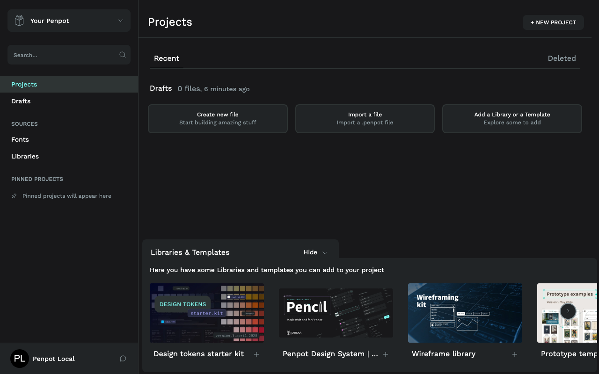
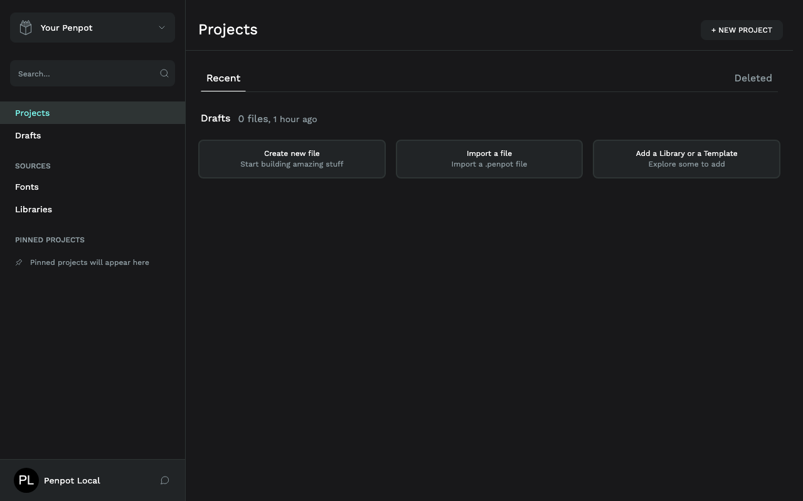
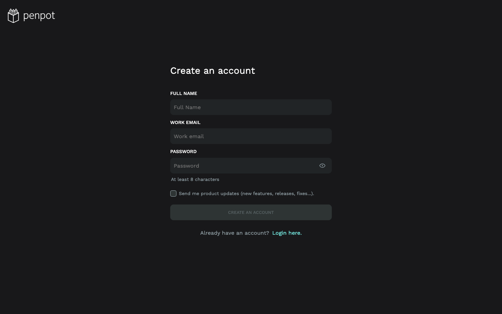
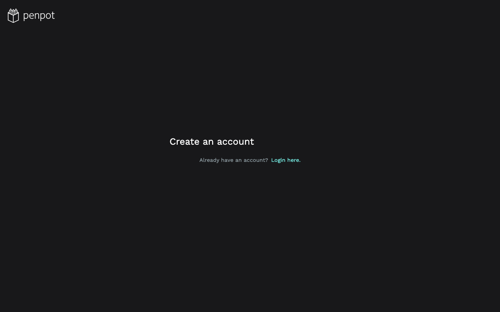
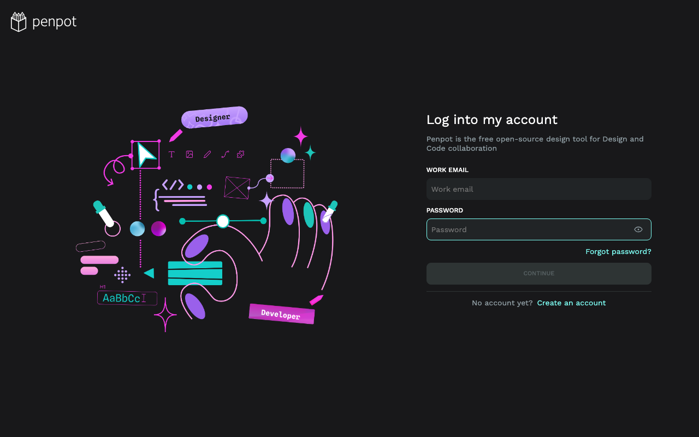
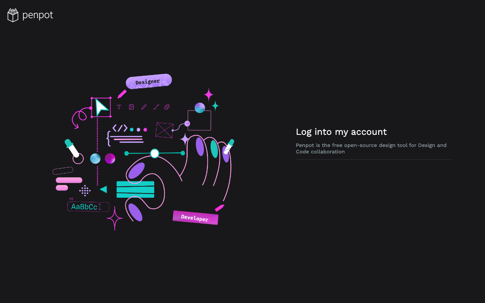
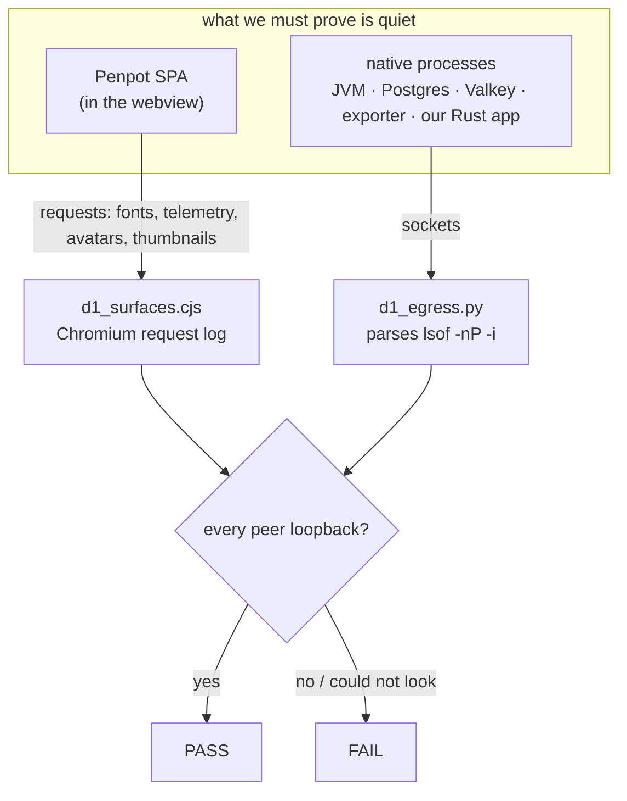

# D1 — Offline & config hardening

**Chapter 4, milestone 1.** Status: complete. Gate: `just d1` (`scripts/d1-offline.sh`),
chained into `just e2e`.

Penpot Local exists so you can design **offline, without an account, entirely on your own
machine**. The app shipped with Penpot's full web experience intact — signup forms, a login
screen, an account page, a templates carousel that loads thumbnails from penpot.app. None of
that means anything when there is exactly one user and no server. D1 removes the surfaces
that Penpot's **own configuration** can remove, and — more importantly — proves the removal
instead of asserting it.

## The rule that shaped this milestone

> The SPA stays byte-untouched. No serve-time patching of upstream JS or CSS, no injected
> scripts. Only configuration and URLs reach the canvas.

Every change here is a Penpot feature flag we set, or our own navigation policy. Nothing
under `runtime/frontend/` was modified. That keeps upgrading Penpot a matter of swapping the
bundle, not re-applying a patch set.

## What changed

Four flags appended to the **frontend** `penpotFlags` string only (`D1_CLOUD_SURFACE_FLAGS`
in [`apps/desktop/src/lib.rs`](../../../apps/desktop/src/lib.rs)). The backend flag string is
deliberately untouched — these are UI surfaces, and a smaller blast radius is worth more than
defence-in-depth we cannot test.

| Flag | Why | Verified effect |
|---|---|---|
| `disable-dashboard-templates-section` | Links to cloud-hosted content | Carousel gone |
| `disable-google-fonts-provider` | A live network dependency | NOT behaviourally verified in D1 — its surface is the workspace font picker, and the gate never opens a workspace (see "Known limits" below) |
| `disable-login-with-password` | No second account to log into | Login form has no fields |
| `disable-registration` | Nobody to register | Removes the login-page link — and, via the flag above, the signup form too |

Plus one product-behaviour change: **the `#/auth/*` routes are now cancelled in the webview
unconditionally**. See "The dormant policy" below.

## Before / after

| Before | After |
|---|---|
|  |  |

The "Libraries & Templates" carousel is gone. Those thumbnails were fetched from penpot.app —
a *visible* violation of the offline promise, sitting on the first screen after login.

| Before | After |
|---|---|
|  |  |
|  |  |

The signup form and the email/password form are both gone. What remains is inert chrome —
a heading and a link.

`img/before-settings-profile.png` and `img/after-settings-profile.png` are **byte-identical**.
D1 changed nothing about the account page: Password, Notifications, Change email, "Want to
remove your account?", Release notes are all still there. Penpot has no flag for them. That
is D2's problem, and saying so plainly is better than implying D1 covered it.

## How the proof works

D1's claim is *zero non-loopback connection attempts across a full session*. Loopback traffic
to our own supervised stack **is** the architecture and is permitted. Two observers, because
neither alone is sufficient:



The browser observer sees what the *page* reaches for; the socket observer sees what the
*processes* reach for. A page can be silent while the JVM phones home, and vice versa.

### Three ways this gate refuses to lie to you

These are the lessons that actually cost time, encoded so they cannot recur:

1. **"We could not look" never reads as "it is absent."** Every surface verdict is tri-state
   — `gone` | `present` | `inconclusive` — behind a proof-of-render check. A page that fails
   to load has no signup form either; reporting that as `gone` would turn the gate green
   while the flag did nothing. `inconclusive` fails loudly, worded as an infrastructure
   failure rather than a real finding.
2. **Effect, not setting — for the flags we can actually check.** All four flags are asserted
   for presence in the served `config.js`, but that alone is never trusted: a renamed or
   silently-ignored upstream flag would still be "served" while the surface came back. Only
   **two of the four** — `disable-dashboard-templates-section` and `disable-login-with-password`
   — get the second, behavioural assertion: the SPA is observed and the surface is required to
   be actually gone, not just flagged. `disable-registration` is also observed behaviourally,
   but the accepted outcome there is `present` (see "Two findings worth recording" below), so
   that observation is not a removal check. `disable-google-fonts-provider` has **no**
   behavioural check at all in D1 — its surface is the workspace font picker, and this gate
   never opens a workspace (see "Known limits"). So this lesson closes the "set but ignored"
   risk for two of the four flags, not all four.
3. **No vacuous passes.** "Zero non-loopback connections" is only trusted after confirming a
   sample actually happened — the gate requires a non-zero count of *loopback* connections
   and a non-zero request count first. An empty measurement and a clean measurement look
   identical unless you check.

## Two findings worth recording

**The two auth flags behaved differently under the same test.** `disable-login-with-password`
is frontend-only: it removed the SPA's login form while `/__bootstrap` kept working, because
that route calls the `login-with-password` RPC *server-side*, governed by the untouched
backend flag. `disable-registration` was weaker — it removed the "Create an account" link but
`#/auth/register` still rendered a working form. Same-sounding flags, different reach. This is
exactly why the milestone required an audit before disabling, and why the gate measures
effect.

The signup form is now gone anyway — but as a **side effect** of
`disable-login-with-password` removing the password-based register form, not because
`disable-registration` did it. Upstream could take that back without notice.

**The navigation policy was dormant.** D0 built a policy that cancels navigations to Penpot's
web routes, but shipped it off by default: `redirect` was true only when
`PENPOT_LOCAL_NAVWATCH_REDIRECT=1`, which only D0's own spike script ever set. The gate
initially cited that policy as the reason a reachable signup form was acceptable — describing
a safeguard that was not switched on. D1 fixes it, scoped:

- `#/auth/*` → cancelled **unconditionally** in the shipped product. There is no account to
  log into or register.
- `#/dashboard`, `#/settings` → **unchanged**, still measurement-only. Closing them now would
  remove the only way to browse files before their native replacement exists. That is D2/D3.

## Known limits — stated, not buried

- **The backend signup RPC stays live, permanently.** Our own single-user provisioning calls
  it, and that path runs on **every DB wipe** — the project's core invariant. Disabling it
  backend-side would break the guarantee that deleting the database loses nothing. The route
  is closed in the webview instead.
- **The account settings page is untouched.** No Penpot flag removes it.
- **`(c/proc)` is a single `lsof` sample**, not a proof of absence: a connection that opens
  and closes between polls could be missed. The gate says so in its own output.
- **No workspace was open** during the surface captures. All shots are dashboard/auth
  surfaces.

## Reproducing

```bash
just d1     # the gate: build, boot, observe, exercise, tear down
just e2e    # the full ladder, D1 included
```

Captures are reproducible via `scripts/shots.sh` at a fixed 1280×800 viewport:

```bash
BASE=http://localhost:9046 OUT_DIR=docs/milestones/d1/img SETTLE_MS=15000 \
  bash scripts/shots.sh after-auth-login='/#/auth/login'
```

Two gotchas that will bite anyone re-capturing: `/__bootstrap` is **one-shot per boot**, so
only one browser session per boot can be authenticated; and the dashboard route is
**team-scoped** (`#/dashboard/recent?team-id=<uuid>`, discovered at runtime — bare
`#/dashboard` renders Penpot's own 404). `docs/milestones/d1/baseline.md` has the full
capture notes.
