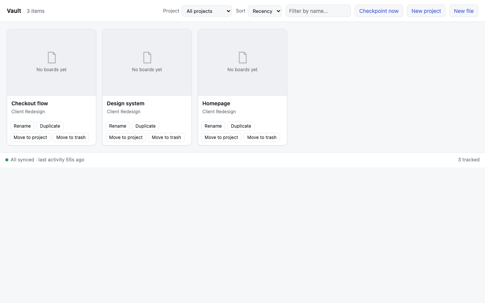
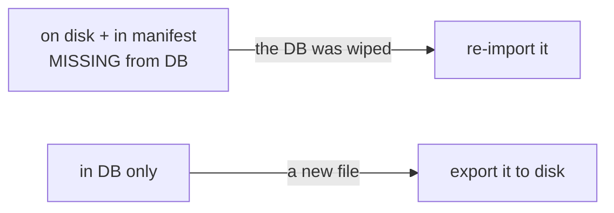

# D2 — The home becomes the front door

**Chapter 4, milestone 2.** Gate: `just d2` (`scripts/d2-home.sh`), chained into `just e2e`.

D1 removed the cloud surfaces. D2 replaces the biggest one: Penpot's dashboard. Our own
`/__home` page can now create projects and files, rename, move, duplicate, delete and open —
and the dashboard is closed off entirely.



## What changed

| Verb | How | Touches the vault? |
|---|---|---|
| New project / New file | `POST /__api/vault/manage/{project,file}` | No — the daemon carries it to disk |
| Rename / Move | `POST /__api/vault/manage/{rename,move}` | No |
| Duplicate | export → import-as-new (there is no `duplicate-file` RPC) | No |
| **Delete** | RPC delete + move the folder to `.trash/` | **Yes — it has to** |

Plus: `#/dashboard` is now cancelled unconditionally in the webview and redirected to
`/__home`, and the "Open dashboard" escape hatch is gone from the page. `#/settings` is
deliberately untouched — its replacement is D4's native Preferences, and closing a surface
before its replacement exists is the mistake D1 caught and corrected.

## Why delete was the hard part

Everything except delete is a pure passthrough: change the DB, let the sync daemon carry the
result to the folder tree. Delete cannot work that way.

The core invariant rebuilds the folder tree into a wiped database. It is a rule over
`(disk, manifest, db)`:



**"The user deleted this file" is indistinguishable from "the database was wiped."** Both
present as the first state. So an RPC-only delete is silently undone at the next startup
reconciliation — the file comes back.

Delete therefore leaves the live tree *and* the manifest together, moving the directory into
a dot-prefixed `.trash/` (already skipped by the daemon walk, the FS watcher and the index, so
trashed files are inert with no new exclusion logic). It **moves rather than removes**: the
folder tree is the user's own work.

It also has an ordering trap. Trash first and the daemon sees "a new file in the DB" and
exports it back; delete first and it sees "a wiped DB" and re-imports it. Both orders lose if
the daemon polls in between — and it polls every 2 seconds. So the operation runs with the
daemon paused, and review of the first implementation found that pausing was not enough:

- `pause()` was a **flag, not a barrier** — it returned immediately, so a poll already in
  flight finished against a pre-pause snapshot. Now `pause_and_wait_idle()` waits for the loop
  to acknowledge, with a timeout that **fails closed** (the delete is refused) rather than
  proceeding unprotected.
- The daemon **caches the manifest in memory**, so the trashed entry was rewritten back on its
  next save. `resume()` now reloads it.
- Client disconnect could drop the pause guard mid-operation, so the work runs in a task the
  caller cannot cancel.

## Three defects this milestone found by running it

None of these were predicted by the plan. Each was found by executing the thing for real.

**1. Rename never renamed the folder.** `allocate_file_path` returned a tracked file's
existing path unconditionally, so the daemon re-exported "Renamed" into `Hello.penpot`
forever. The app and the folder tree disagreed permanently — in a project whose whole premise
is that the folder tree is the truth. Fixed by relocating the directory when the desired path
changes, with explicit protection against fighting the de-duplication suffixes (which would
otherwise rename-loop on every poll).

**2. Move never moved anything** — found by the gate, not by hand. The change detector keyed
only on `(revn, modifiedAt)`:

```rust
last_synced: HashMap<String, (i64, String)>,
```

Penpot's `move-files` changes a file's project without bumping either, so the daemon concluded
"unchanged", never exported, and the relocation code never ran. The key now includes the
fields that determine the on-disk path — project and name — because the location is not a
function of the content version.

**3. The front door hid the files it had just created.** The listing was board-centric, and a
newly created file has a page but no board. So you could create a file and never see it, which
also made rename/duplicate/delete unreachable for it — with the dashboard closed, there was no
fallback. Every file in the manifest now gets a card.

There was also a dead end caught in review: a brand-new *empty* project never appeared in the
project picker, because the picker was fed by the disk-only index and an empty project has no
folder. The picker now reads the authoritative list from the DB, with soft-deleted projects
filtered out.

## What the gate asserts

`just d2` — 31 checks, green twice:

- the full lifecycle through our own routes only: new project → new file → rename → duplicate
  → move → delete
- the folder tree reflects every step, polled with a timeout (the daemon polls every 2 s and
  the index lags one further, so a first-read assertion would be flaky). Rename and move assert
  **both halves** — the new path exists *and* the old one is gone.
- **the load-bearing one:** a deleted file stays deleted **across a restart**, sampled
  continuously over 20 s against disk, manifest and DB, with the startup reconciliation
  required to report `imports=0`. A delete that survives one boot but not two is exactly the
  failure the trash design exists to prevent.
- `#/dashboard` is never loaded in the whole session (read from the navigation log), with
  proof-of-looking: the escape hatch must be absent *and* the action controls present, so a
  broken page cannot pass as "no dashboard".
- **D0's deferred caveat, discharged.** D0 proved the vault survived a mid-session redirect but
  measured a seeded canary with *no workspace open*. D2 opens a real file via the deep link read
  off a live card, lets it fully render, then attempts the dashboard navigation, and asserts the
  vault tree hash is unchanged.

## Known limits — stated, not buried

- **Nothing empties `.trash/`.** It grows until the user clears it in Finder. There is no
  retention policy and no in-app "empty trash" yet.
- **Deleting a project is not exposed.** Only files can be deleted. Penpot's `delete-project`
  is a soft delete and the folder-side story for it is not designed yet.
- **A rename only relocates on the next export.** A file renamed while otherwise unchanged
  keeps its old folder name until something else about it changes. Files renamed by an older
  build stay stale until touched.
- **An offline move can still be missed at boot.** The startup reconciliation's own comparison
  still keys on `(revn, modifiedAt)`; only the running poll loop learned about project/name
  changes.
- **`#/settings` is still reachable** — D4 replaces it.
- **Duplicate copies media but not linked libraries** (`include_libraries=false`,
  `embed_assets=true`); the pair `(true, true)` is rejected by the server.
- **The vault index is disk-only**, so a project with no files at all exists only in the DB and
  would not survive a database wipe. That is consistent with the invariant — there is no user
  work in an empty project — but it is worth knowing.
