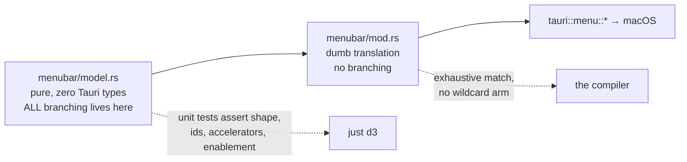

# D3 — Native menu bar, shortcuts, Open Recent

**Chapter 4, milestone 3.** Gate: `just d3` (`scripts/d3-menus.sh`), chained into `just e2e`.

D1 removed the cloud surfaces. D2 replaced the dashboard with our own front door. D3 adds the
thing that most makes an app feel native rather than "a web page in a window": a real menu bar,
real keyboard shortcuts, and one window per open file.

## What it looks like, verified against the running app

Native chrome cannot be screenshotted safely from an automated session — a screen capture takes
a region of the display, not a window, so it grabs whatever else is on screen. Instead this is
the **live menu structure read out of the running app** via macOS accessibility, which is
exact, re-runnable, and cannot be faked by a stale image:

```
menu bar:   Apple, Penpot Local, File, Edit, View, Window, Help

Penpot Local:  About Penpot Local, —, Services, Hide Penpot Local, Hide Others,
               Show All, —, Quit Penpot Local            (Quit → ⌘Q)
File:          New File (⌘N), New Project, —, Open… (⌘O), Open Recent,
               Open Vault…, —, Import…, Export…, —, Reveal in Finder
View:          Home, Search (⌘F), Palette, Packages, Templates
Window:        ✓  Penpot Local, —, Minimize, Zoom, Close Window, Close All
```

Note `✓ Penpot Local` in the Window menu: the key window really is marked.

## How a menu bar gets tested at all

CI can never click a menu. So D3 borrows the pattern the tray already established:



Everything that could branch — which items exist, which are enabled, which command each
carries — lives in a plain Rust module with no Tauri imports, so it is unit-testable without a
window, a display, or a runtime. The translation layer has no decisions of its own, and its
dispatch is an exhaustive `match` with **no wildcard arm**, so adding a command without wiring
it fails to compile rather than shipping a dead menu item.

The gate then asserts: the model's shape by name (specific test names, not "the suite passed" —
a renamed test would otherwise leave it green), and that every command behind the menu really
works headlessly against a live stack.

## Window-per-file

Open question 1 from PLAN4 is resolved: each file gets its own window with its filename in the
title. That required removing an assumption baked into six places — the single-instance
refocus, window construction, the navigation redirect, the vault switch, post-boot navigation
and the boot-failure title all looked up a window hardcoded as `"main"`. Each would have
silently targeted the wrong window once a second existed.

Opening a file that is already open **focuses** its window rather than opening a duplicate.

## Two defects found by review, both invisible without running it

**1. Installing a menu bar deleted the application menu — including Quit.** `AppHandle::set_menu`
*replaces* the default macOS menu wholesale. With five submenus and no application submenu, the
app lost About, Services, Hide and **Quit**, ⌘Q stopped working, and macOS put "File" in the
app-name slot. An app that cannot be quit from its own menu is not a subtle bug, and nothing in
the unit tests could see it — the model was internally consistent. Fixed by making the
application section the first thing the model emits, pinned by a test.

**2. A redirected file window became a ghost.** File windows shared the *home* window's
navigation policy verbatim, and that policy redirects `#/dashboard` to `/__home` **in the window
that navigated**. So a file window that hit the dashboard route became a Home window while the
registry still recorded its file: the Window menu kept showing the filename, Export and Reveal
acted on a file that window no longer displayed, and reopening that file focused a window
showing Home. Fixed by giving each window its own recovery destination — one policy body, one
parameter — rather than forking the rules into two copies that could drift.

## Known limits — stated, not buried

- **Preferences and ⌘, are deliberately absent.** They arrive in D4 together with the window
  they open. Shipping the item early would have meant a dead menu entry, which is exactly what
  this milestone's central rule forbids.
- **Seven commands are not covered by the gate**, and it prints them rather than implying full
  coverage: Open…, Import…, Export…, About and Known Limits all end in a native picker or modal
  with no headless equivalent; FocusWindow needs a second live window; Open Recent's store is
  proven directly but its GUI dispatch is not.
- **The two-window / two-title / ⌘Q leg is SKIPPED, not passed.** Driving a second window needs
  real menu clicks, and no Tauri IPC command exists to trigger one. The gate prints it as
  SKIPPED with the reason and keeps it out of the pass count. The controller verified the menu
  structure, ⌘Q and the accelerators live via accessibility, which is recorded above.
- **The pickers are macOS-only**, mirroring the existing folder picker. On other platforms they
  return nothing rather than pretending.
- **`Open…` uses a folder picker on purpose:** a `.penpot` is a directory here, not a file. A
  file picker literally could not select anything in the vault.
- **The Window menu is app-wide**, because macOS has no per-window menu — it is rebuilt whenever
  the window set or key window changes, the same way the tray rebuilds on every status change.
- **No accelerator collision was found** between the menu's ⌘F and the N4 global palette
  shortcut: they are different mechanisms (a global shortcut fires even unfocused), and the
  palette's default is not ⌘F. This was checked rather than assumed, because a clash would show
  up as one of them silently not firing.
