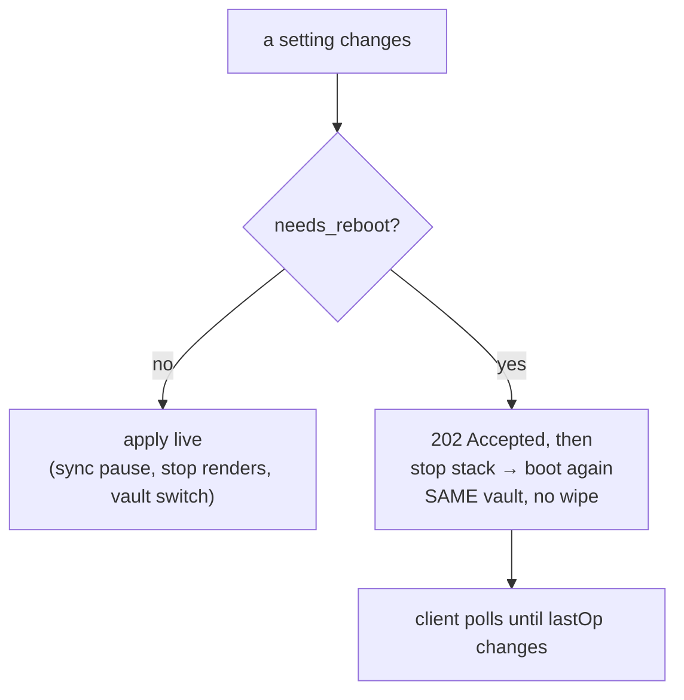

# D4 — Native Preferences

**Chapter 4, milestone 4.** Gate: `just d4` (`scripts/d4-preferences.sh`), chained into `just e2e`.

D1 removed the cloud surfaces. D2 replaced the dashboard. D3 gave the app a real menu bar. D4
gives it Preferences — and with the replacement finally in place, **`#/settings` is now closed**,
the last of Penpot's account surfaces to go.

`⌘,` opens it, which also means D3's deliberately-omitted Preferences item is no longer a hole.

## What it controls

| Setting | Applies |
|---|---|
| Vault location / switch | **Live** — delegates to the N5 `switch_to` machinery, unchanged |
| Sync on/off | **Live**, and now persisted |
| Renders (thumbnails/exporter) — turning OFF | **Live** — stops the poll loop |
| Renders — turning ON | **Reboot** — the supervisor cannot hot-add the exporter child |
| Plugins | **Reboot** — baked into `config.js` |
| CSP | **Reboot** — baked into the response header |

## The shaping constraint: half of these cannot apply to a running app

`config.js` is read **once**, at SPA script load. A page that is already running has already
executed it, so changing `penpotFlags` afterwards is invisible to it no matter what the server
serves. And the supervisor has no API to add a child process to a running stack.

So rather than the usual "restart the app for this to take effect", D4 **reboots the supervised
stack in place** — reusing the same stop/boot sequence the N5 vault switch already proves — with
one hard constraint:

> A reboot must **not** wipe the disposable database. A vault switch does, because the vault
> changed and its files must be re-imported. Here the vault has not changed, and re-importing
> every file to apply a checkbox is the wrong cost.

That is a pure function (`wipes_disposable_state`) with a test, not a comment.

## Three defects found by running it

**1. The plugins and CSP toggles did nothing.** They existed in the UI and in `needs_reboot`, so
the app told the user "restart and this will apply" — while `boot()` never read them. The product
promised something it did not do. Now both are wired, with `PENPOT_LOCAL_CSP` kept authoritative
over the preference because the gates rely on it as an escape hatch.

**2. Two routes destroyed the server meant to answer them.** `POST /__api/prefs/vault` and
`/__api/prefs/reboot` awaited an operation that stops the whole stack — including the proxy
serving that very request — then boots a new one. The response could never arrive; the gate
caught it as a socket timeout. Both now **acknowledge first** (`202`) and do the work in a
detached task, with the outcome recorded in a `lastOp` field so a failure is still visible after
the connection is gone. The client polls until `lastOp` *changes*, not merely until some request
succeeds — the old stack can still answer for a moment.

**3. Renaming a test broke another milestone's gate.** Closing `#/settings` renamed the navwatch
tests, and `scripts/d1-offline.sh` requires specific test names *by name* — deliberately, so that
"the suite passed" is not good enough. `just e2e` would have gone red. Fixed, and D1 re-run to
prove it: 17/0.

## The failure this milestone must not ship

`SyncControl` is constructed **unpaused on every boot**, and a vault switch calls `boot()` again.
Without re-applying the stored preference, "sync off" would silently turn itself back on at every
restart and every vault switch. A preference that forgets itself is worse than no preference, so
the gate asserts it survives a restart.

## What the gate proves

`just d4`, green twice:

- preferences persist across a restart — checked in the file **and** through the API
- a live setting really takes effect: sync off means the daemon reports paused, not just that a
  file changed
- **the exit criterion — turning renders off actually stops renders.** With renders on, an edit
  produces a fresh render; with them off, the same edit produces none. The absence leg only runs
  **after** the positive case is proven, because a broken exporter would otherwise pass it
  trivially
- sync-off survives a restart (the failure above)
- a Preferences-initiated vault switch keeps **zero cross-vault spill**, asserted with the N5
  helper rather than a reimplementation
- a reboot-in-place does **not** wipe the DB — files survive with their **original ids**
- a boot-time toggle really applies after the reboot, asserted against the **served** `config.js`
  and CSP header, not the saved file
- a **failed** switch is observable rather than silent

## Known limits — stated, not buried

- **Rebooting under an open workspace** is a real event the user opts into via "Apply & Restart".
  The stack goes away and comes back; the page polls through it.
- **The vault path is a text field**, not a folder picker — a plain webview page cannot open a
  native picker. `File > Open Vault…` in the menu bar has the real picker.
- **"Updates" is not implemented**, deliberately. An update check means contacting a server,
  which collides head-on with this chapter's own invariant that a normal session makes zero
  non-loopback connection attempts. That deserves its own decision; D6's residue audit is the
  place for it. About shipped in D3.
- **The pickers remain macOS-only**, as they were in D3.
- **`lastOp` is a single slot**, overwritten by whichever operation finishes last. Fine for a
  window a person is looking at; not an audit log.
