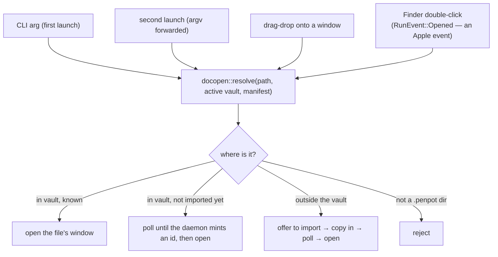

# D5 — OS integration: documents, windows, drag-and-drop

**Chapter 4, milestone 5.** Gate: `just d5` (`scripts/d5-documents.sh`), chained into `just e2e`.
Spike: `docs/spikes/finder-document-association.md` (`scripts/d5a-finder-spike.sh`).

D3 made the app window-per-file. D5 connects those windows to the OS: a `.penpot` opens in its
own window from a CLI argument, a second launch, a drag-drop, or a Finder double-click.

## One funnel, four doors

Everything that opens a document goes through the same path — resolve a filesystem path to a
**file-id**, then open that file's window:

A `.penpot` is a **directory** (an unzipped binfile), so the resolver canonicalizes both the
path and the vault root before deciding in-vault vs external — a `..`/symlink path must not
masquerade across the vault boundary. If either can't be resolved it **fails closed**, because
that boundary is a P0 cross-vault-spill line.

## The spike that de-risked Finder

The survey flagged that macOS won't treat a *directory* extension as a double-clickable
document without `LSTypeIsPackage`, which Tauri's config can't express. Rather than build on an
assumption, D5a spiked it (verdict in `docs/spikes/finder-document-association.md`). Findings,
all now confirmed on the **real packaged app**:

- A `.penpot` directory declared with `LSTypeIsPackage` + `com.apple.package` conformance is
  resolved by LaunchServices as an opaque package (`isPackage: true`), so a double-click
  launches the app instead of browsing into the folder. The packaged `Info.plist` carries our
  UTI *and* Tauri's own keys — a clean merge, verified by `scripts/d5-plist-check.sh` against
  the built `.app`.
- **The document path is NOT a command-line argument.** macOS delivers it via the
  open-documents Apple event, surfaced as `RunEvent::Opened { urls }`. D5 handles that; a bare
  launch would see empty argv.
- It works **only from a signed, installed `.app`.** An unsigned dev build is `untrusted` —
  LaunchServices resolves the type but won't bind it as the default handler. The shipped app
  ad-hoc signs, so it clears the bar; a `cargo run` build never will.

That last point sets the honest testing split: **the headless gate proves the CLI-argument,
second-launch, and import paths; Finder double-click is proven by the spike + a manual
packaged-build check**, not asserted headlessly.

## What the gate proves (47 checks, green twice)

- **Launch with a path argument opens that file** — asserted through a new `GET /windows`
  control route that reports the open-window set (label, file-id, title) from outside the
  process. D3's own gate hit the wall that the window registry wasn't observable from a shell;
  D5 fixes that.
- **The window title tracks the open file** — including a live rename while the window is open
  (`DocA` → `DocA Renamed`), via the existing sync-status channel, no new poll loop.
- **A second launch forwards its document** instead of double-booting — the M5-cooperation
  criterion. Instance 2 exits, no second stack boots, no ports double, and instance 1's
  `/windows` *gains* the forwarded document's window. That last check is what distinguishes
  "forwarded" from "merely refused to launch".
- **Import keeps zero cross-vault spill** — an external `.penpot` copied into vault A appears in
  A's DB and search index and in **none** of vault B's DB/boards/search.

## Two defects the review loop caught, both P0-adjacent

- **The resolver's canonicalize-failure fallback** returned the raw path — the exact escape the
  brief warned about, a spill vector. Now fails closed.
- **`offer_import` snapshotted the vault before the confirm dialog**, which doesn't block the
  event loop — so a vault switch mid-prompt could have copied into the wrong vault. Now
  re-snapshots after confirmation.

And a gate flake worth naming: leg (d) gated presence on the `/boards` listing, which lags the
DB/search barriers and flapped. The import was always real (in DB + searchable); the fix rests
presence on those authoritative barriers and treats the listing as informational — the spill
guarantee is unchanged.

## Known limits — stated, not buried

- **Finder double-click is not in the headless gate** — it needs a signed, installed app (D5a),
  so it's covered by the spike + the packaged plist check, and a manual double-click on an
  installed build. This is a tooling boundary, not a coverage gap hidden.
- **Drag-drop is verified manually**, not headlessly (no way to synthesize an OS drag in CI).
  The resolver and `open_document` decision it funnels into are unit-tested.
- **Offer-to-import is a copy + poll**: the file appears once the daemon imports it (bounded by
  a 20s poll); on timeout the user is told it's still importing rather than left hanging.
- **A custom URL scheme (`penpot://`) is out of scope** — a second registration surface with no
  offline use case.
- **An imported file's appearance in the `/boards` home listing** is tracked as a separate
  question (it is always in the DB and search; its listing-card timing varied in the gate) —
  not a spill or correctness issue.
- **Finder, drag-drop and the pickers remain macOS-only.**
