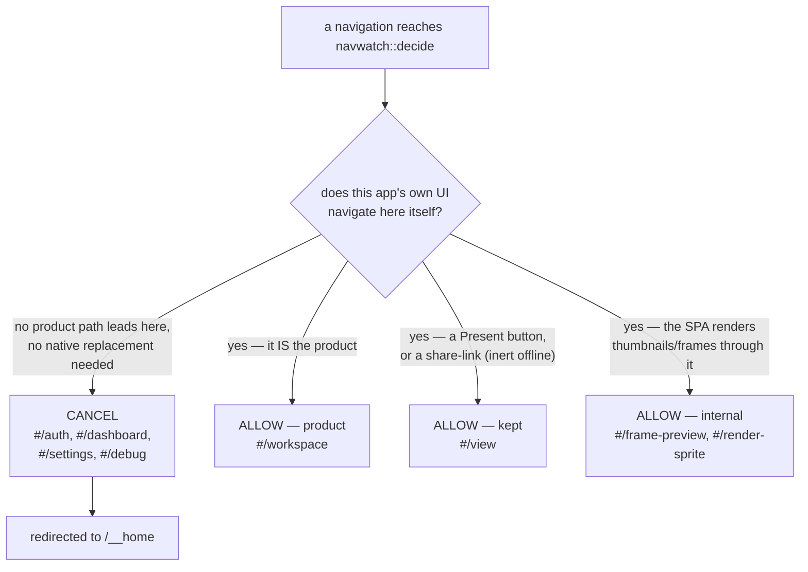

# D6 — Residue audit: the chapter closer

**Chapter 4, milestone 6.** Gate: `just d6` (`scripts/d6-residue.sh`), chained into `just e2e`.
Extended leg: `scripts/m4-artifact-test.sh` (packaged-artifact suite). Plan:
[`docs/superpowers/plans/2026-07-21-d6-residue-audit.md`](../../superpowers/plans/2026-07-21-d6-residue-audit.md).

D1 through D5 each closed one web surface as its native replacement shipped: cloud auth, the
dashboard, settings. Every one of those milestones described its own closure as "no web route
reaches the canvas" — but none of them, nor any doc, had ever walked the **whole** shipped route
table to check that claim against reality. D6 is that walk. It is chapter 4's closer: the
milestone whose entire job is to audit, not to add a feature.

## What the audit found and closed

The shipped SPA bundle does not elide `*assert*` calls, so every top-level hash route compiled
into it is reachable by typing the URL fragment by hand — not just the routes our own UI links
to. Walking the bundle turned up two routes nobody had accounted for: `#/debug/icons-preview`
and `#/debug/playground`, inert Penpot developer tooling that the app never navigates to and that
had sat reachable, unredirected and undocumented, through five prior milestones.

D6 cancels `#/debug` unconditionally in [`navwatch.rs`](../../../apps/desktop/src/navwatch.rs),
the same mechanism D1/D2/D4 used for `#/auth`, `#/dashboard`, and `#/settings`. No native
replacement was needed — nothing in the product depends on debug tooling, so closing it costs
nothing. `navwatch.rs`'s module doc comment is now the authoritative route-accounting table,
pinned by tests, so a future route added to the bundle can't silently reopen this gap.

## The route table, all eight families

| Route family | Verdict | Closed/kept in | Why |
|---|---|---|---|
| `#/auth/*` | Cancelled | [D1](../d1/README.md) | No second account to log into or register |
| `#/dashboard/*` | Cancelled | [D2](../d2/README.md) | `/__home` shipped as its replacement |
| `#/settings/*` | Cancelled | [D4](../d4/README.md) | The native Preferences window shipped as its replacement |
| `#/debug/*` | Cancelled | D6 (this milestone) | Inert dev tooling the app never navigates to; no replacement needed |
| `#/workspace/*` | Allowed — the product | always | This **is** the product |
| `#/view/*` | Allowed — kept | decided in D0/D1 | Present mode; our own Present buttons navigate here, and a share-link pointing at it is inert offline anyway |
| `#/frame-preview`, `#/render-sprite/:id` | Allowed — internal | always | The SPA navigates to these **itself** to render thumbnails and frames; cancelling either risks breaking rendering — the `#/view` lesson repeated |
| `#/subscribe-nitrate` | Absent | n/a | Gated behind a flag this build does not set; never compiles into the route tree |

## Classifying a navigation

Every route family in the table above lands in exactly one of these four buckets. The bucket a
route falls into is a design decision, not an accident of what happened to get built first —
`#/debug` sat unclassified for five milestones precisely because nobody had drawn this diagram
against the full route table until now.

## The packaged proof

The hash fragment a webview navigates to never reaches the server — the proxy, and therefore
`curl` against the running stack, cannot see it. The **only** valid evidence that the packaged
app boots into the native home rather than the dashboard is the navwatch JSONL log
(`PENPOT_LOCAL_NAVWATCH_LOG`), read from outside the process. `scripts/m4-artifact-test.sh` gained
two legs on top of D1–D5's packaging checks:

- **(h) navwatch boot proof** — boots the packaged `.app`, resolves `/__bootstrap` →
  `/__home`, and asserts that no observation anywhere in the session is a `#/dashboard`,
  `#/auth`, or `#/settings` fragment. An empty or absent log is treated as an infrastructure
  failure, never as a pass — the same "no vacuous passes" discipline D1 established.
- **(i) offline egress strengthening** — boots the packaged app under `env -i` with poisoned
  proxies (a non-loopback connection cannot succeed even in principle in that harness), samples
  `lsof -nP -i` across the **full packaged stack**, and asserts zero non-loopback peers. This
  reuses D1's own `d1_egress.py` loopback predicate rather than a second implementation, and it
  strengthens — it does not replace — the caveat D1's own known-limits section already names:
  D1's sample was a single `lsof` snapshot over the dev stack, not a proof of absence. Running
  the same predicate against the packaged artifact, under a harness that cannot succeed at
  non-loopback egress at all, closes more of that gap than another dev-mode sample would.

Both legs are part of the packaged-artifact suite, which needs a real build (`scripts/build-dmg.sh`)
and — like every native-chrome check since D3 — a macOS GUI session. They are not part of the
plain headless unit-test run.

## Known limits

This milestone's full accounting of what the app removed, what it kept and why, and what
remains testing-honest versus not, lives in [`docs/known-limits.md`](../../known-limits.md) —
this document does not repeat it.

## Native captures — MANUAL, not taken in this pass

Per PLAN4, native chrome (the menu bar, dialogs, window titles) is OS-level UI outside any
browser and is not capturable by an automated session — a screen capture grabs the whole
display, not a window, and risks recording unrelated content. **No screenshots were captured in
this pass.** A human with a real GUI session should take, at minimum:

- [ ] The menu bar (Penpot Local, File, Edit, View, Window, Help) with a file window focused
- [ ] The Preferences window (`⌘,`), showing the vault, sync, renders, plugins and CSP controls
- [ ] A `.penpot` file open in its own window, title bar showing the filename
- [ ] A Finder double-click on a packaged `.app` opening that file (the D5a-verified path)

Until those are taken, this document accurately describes native behaviour from the gates'
accessibility-tree reads and prior milestones' manual verification (D1, D3, D5), not from images.
