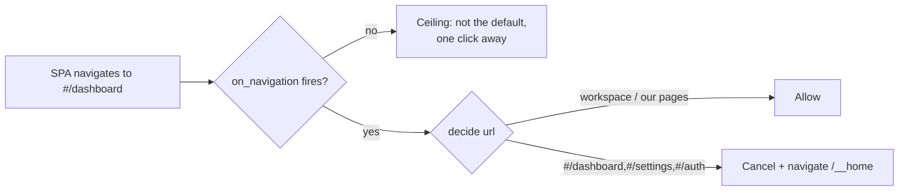

# D0 — Navigation Control Spike Implementation Plan

> **For agentic workers:** REQUIRED SUB-SKILL: Use superpowers:subagent-driven-development (recommended) or superpowers:executing-plans to implement this plan task-by-task. Steps use checkbox (`- [ ]`) syntax for tracking.

**Goal:** Determine, with live evidence, whether the Tauri webview can observe and redirect Penpot's SPA **hash** navigation (`#/dashboard`, `#/settings`, `#/auth`) to native equivalents **without touching the SPA** — and record a GO/NO-GO that sets chapter 4's ceiling.

**Architecture:** Three independent probes. (1) A **mechanism probe** on *our own* test page (`/__navprobe`) isolates the question "does `on_navigation` fire for same-document hash changes / `pushState` / full navigations?" — our page, our JS, so zero invariant tension. (2) A **reality check** determines how Penpot's own dashboard affordance actually navigates (anchor `href` vs JS router), because a mechanism that works on our page is useless if Penpot never triggers it. (3) A **redirect + state-integrity** probe confirms that cancelling a navigation mid-session and redirecting to `/__home` does not corrupt the open workspace file.

**Tech Stack:** Rust + Tauri 2.11.5 (`WebviewWindowBuilder::from_config` + `on_navigation`), Axum (the existing extra-router), the bundled offline Playwright Chromium (read-only DOM inspection only), bash + Python 3 stdlib for the gate.

## Global Constraints

- **Invariant 3 — the SPA stays byte-untouched.** No serve-time patching of upstream JS/CSS, no injected scripts, no `eval`/`webview.eval()` against Penpot's origin. Only URLs reach the canvas. The observation mechanism must itself be invariant-clean: reading `on_navigation` callbacks or `webview.url()` is allowed; injecting JS into Penpot to watch `location` is **not**.
- **Our own `/__navprobe` page may run our own JS.** It is our page on our route, not Penpot's SPA. This is the isolation that keeps the mechanism probe clean.
- **Dedicated ports (verified unused):** proxy `9034`, backend `6496`, postgres `5569`, valkey `6512`, control `9037`. (`9035` is taken by `build-runtime-bundle-linux.sh` — do not use it.)
- **Teardown is PID-scoped.** Kill only PIDs this gate recorded. Never `pkill`/`killall` by name — sibling gates may be running on other port blocks.
- **Gate discipline:** `scripts/d0-navigation-spike.sh` must be run-twice idempotent, use fresh `mktemp` dirs, seed the pg-install cache like sibling scripts, strip ANSI before grepping logs, keep dirs on failure, and free all ports on exit.
- **NOT chained into `just e2e`** — D0 is a pure-verdict spike that lands no product behaviour change by default (per the E5/E6 precedent recorded in PLAN4.md). Add a `just d0` recipe only.
- **This gate requires a GUI session** (it opens a real Tauri window). It is not CI-headless. Say so in the docs rather than implying otherwise.
- **No bare `#<number>` in any GitHub-rendered text** (commit messages, PR bodies, docs) unless referencing a real PR/issue.
- Commit messages end with: `Co-Authored-By: Claude Fable 5 <noreply@anthropic.com>`

---

## File Structure

| File | Responsibility |
|---|---|
| `apps/desktop/src/navwatch.rs` *(new)* | The invariant-clean observation + redirect policy. Owns: reading the two env switches, appending JSONL observations, deciding allow/cancel for a URL. Pure and unit-testable — no Tauri types in the decision function. |
| `apps/desktop/src/navprobe.html` *(new)* | Our own test page. Triggers hash change / `pushState` / full navigation on command via query string. Never loaded in normal use. |
| `apps/desktop/src/navprobe.rs` *(new)* | Axum route serving `navprobe.html` at `/__navprobe`. |
| `apps/desktop/src/lib.rs` *(modify)* | Register `navprobe::router()` into the existing extra-router merge chain. |
| `apps/desktop/src/main.rs` *(modify)* | Build the main window in Rust via `WebviewWindowBuilder::from_config` so `on_navigation` can be attached; wire `navwatch`. |
| `apps/desktop/tauri.conf.json` *(modify)* | Empty the `windows` array so Tauri does not auto-create the window we now build in Rust. |
| `scripts/d0_navprobe.py` *(new)* | Drives the probe: launches the app with the watch log enabled, waits, reads the JSONL, emits findings JSON. |
| `scripts/d0_penpot_nav.cjs` *(new)* | Read-only DOM inspection of Penpot's dashboard affordance (anchor vs JS router) via bundled Chromium. |
| `scripts/d0-navigation-spike.sh` *(new)* | The gate: boots the stack on D0 ports, runs all three probes, asserts, tears down PID-scoped. |
| `justfile` *(modify)* | Add the `d0` recipe. Do **not** touch the `e2e` chain. |
| `docs/spikes/navigation-control.md` *(new)* | The verdict doc: captured evidence + GO/NO-GO + what it means for D2/D6. |
| `docs/milestones/d0.md` *(new)* | What changed / how it works (Mermaid) / visuals / known limits. |

---

### Task 1: The `/__navprobe` test page and route

**Files:**
- Create: `apps/desktop/src/navprobe.html`
- Create: `apps/desktop/src/navprobe.rs`
- Modify: `apps/desktop/src/lib.rs`

**Interfaces:**
- Consumes: nothing.
- Produces: `navprobe::router() -> axum::Router` serving `GET /__navprobe`. The page accepts `?run=<case>` where `<case>` ∈ `hash` | `pushstate` | `full`, performs that one navigation 300 ms after load, and sets `document.title` to `navprobe:<case>:done`.

- [ ] **Step 1: Write the failing test**

Add to the bottom of the new file `apps/desktop/src/navprobe.rs`:

```rust
#[cfg(test)]
mod tests {
    use super::*;

    #[test]
    fn page_declares_all_three_navigation_cases() {
        // The probe page must be able to trigger each navigation KIND we need to
        // distinguish; a missing case would silently narrow the spike.
        assert!(PROBE_PAGE_HTML.contains("location.hash"), "hash-change case");
        assert!(PROBE_PAGE_HTML.contains("history.pushState"), "pushState case");
        assert!(PROBE_PAGE_HTML.contains("location.assign"), "full-navigation case");
    }

    #[test]
    fn page_marks_completion_in_the_title() {
        // The runner polls the window title to know a case finished, so the
        // marker string is load-bearing.
        assert!(PROBE_PAGE_HTML.contains("navprobe:"), "completion marker");
    }
}
```

- [ ] **Step 2: Run the test to verify it fails**

Run: `cargo test -p penpot-desktop navprobe -- --nocapture`
Expected: FAIL — `cannot find value PROBE_PAGE_HTML` / module `navprobe` not found.

- [ ] **Step 3: Write the probe page**

Create `apps/desktop/src/navprobe.html`:

```html
<!doctype html>
<meta charset="utf-8" />
<title>navprobe:idle</title>
<style>
  body { font: 14px -apple-system, system-ui, sans-serif; padding: 2rem; }
  code { background: #eee; padding: 0 .25rem; }
</style>
<h1>D0 navigation probe</h1>
<p>This page is OURS (not Penpot's SPA). It performs one navigation on command so
the Rust side can record what <code>on_navigation</code> observed.</p>
<p id="state">idle</p>
<script>
  // Our own page, our own JS — invariant 3 governs Penpot's SPA, not this route.
  const params = new URLSearchParams(location.search);
  const run = params.get("run");
  const state = document.getElementById("state");

  function done(kind) {
    state.textContent = "ran: " + kind;
    document.title = "navprobe:" + kind + ":done";
  }

  // Delay so the harness can attach and the initial load settles first.
  setTimeout(() => {
    if (run === "hash") {
      // Same-document fragment change — the case Penpot's router uses.
      location.hash = "#/dashboard";
      done("hash");
    } else if (run === "pushstate") {
      // History API — produces NO navigation event in most engines.
      history.pushState({}, "", "#/settings");
      done("pushstate");
    } else if (run === "full") {
      // Control case: a real document navigation that MUST be observed.
      done("full");
      location.assign("/__navprobe?run=none&stage=second");
    } else {
      done("none");
    }
  }, 300);
</script>
```

- [ ] **Step 4: Write the route module**

Create `apps/desktop/src/navprobe.rs`:

```rust
//! D0 spike: our own navigation test page.
//!
//! Isolates the mechanism question — "does the webview report a same-document
//! hash change?" — on a page WE control. Penpot's SPA is never involved, so
//! invariant 3 (the SPA stays byte-untouched) is not in tension here.
//!
//! Not reachable in normal use: nothing links to `/__navprobe`.

use axum::{response::Html, routing::get, Router};

/// The probe page, compiled in (mirrors the `include_str!` pattern used by
/// `home.rs` / `http.rs` for `/__home` and `/__search`).
pub const PROBE_PAGE_HTML: &str = include_str!("navprobe.html");

async fn probe_page() -> Html<&'static str> {
    Html(PROBE_PAGE_HTML)
}

/// Router merged into the proxy's extra router.
pub fn router() -> Router {
    Router::new().route("/__navprobe", get(probe_page))
}

#[cfg(test)]
mod tests {
    use super::*;

    #[test]
    fn page_declares_all_three_navigation_cases() {
        assert!(PROBE_PAGE_HTML.contains("location.hash"), "hash-change case");
        assert!(PROBE_PAGE_HTML.contains("history.pushState"), "pushState case");
        assert!(PROBE_PAGE_HTML.contains("location.assign"), "full-navigation case");
    }

    #[test]
    fn page_marks_completion_in_the_title() {
        assert!(PROBE_PAGE_HTML.contains("navprobe:"), "completion marker");
    }
}
```

- [ ] **Step 5: Register the module and merge the router**

In `apps/desktop/src/lib.rs`, add the module declaration alongside the existing ones (they are alphabetical — insert between `home` and `overlay`):

```rust
pub mod navprobe;
```

Then find the extra-router merge chain (search for `.merge(templates_routes)`) and add the probe router to it:

```rust
        .merge(templates_routes)
        .merge(packages_routes)
        .merge(navprobe::router());
```

- [ ] **Step 6: Run the tests to verify they pass**

Run: `cargo test -p penpot-desktop navprobe`
Expected: PASS — 2 tests.

- [ ] **Step 7: Verify the route actually serves**

Run: `cargo build -p penpot-desktop`
Expected: builds clean.

- [ ] **Step 8: Commit**

```bash
git add apps/desktop/src/navprobe.rs apps/desktop/src/navprobe.html apps/desktop/src/lib.rs
git commit -m "$(cat <<'EOF'
D0: add the /__navprobe test page (our own page, not Penpot's SPA)

Isolates the mechanism question for the navigation-control spike: can the
webview observe a same-document hash change? Using our own route keeps
invariant 3 out of the picture entirely — the SPA is never touched.

Co-Authored-By: Claude Fable 5 <noreply@anthropic.com>
EOF
)"
```

---

### Task 2: The navwatch policy (pure, unit-tested)

**Files:**
- Create: `apps/desktop/src/navwatch.rs`
- Modify: `apps/desktop/src/lib.rs`

**Interfaces:**
- Consumes: nothing.
- Produces:
  - `navwatch::Decision` — enum `{ Allow, CancelAndRedirect(String) }`
  - `navwatch::decide(url: &str, redirect_enabled: bool) -> Decision` — pure; maps a URL to a policy decision. `#/dashboard`, `#/settings`, `#/auth` → `CancelAndRedirect("/__home")` when `redirect_enabled`, else `Allow`.
  - `navwatch::NavWatch::from_env() -> NavWatch`, `.record(source: &str, url: &str)`, `.redirect_enabled() -> bool`
  - Env switches: `PENPOT_LOCAL_NAVWATCH_LOG` (path to a JSONL file; absent ⇒ no recording) and `PENPOT_LOCAL_NAVWATCH_REDIRECT` (`1` ⇒ enable redirect).

- [ ] **Step 1: Write the failing test**

Create `apps/desktop/src/navwatch.rs` with only the tests first:

```rust
#[cfg(test)]
mod tests {
    use super::*;

    #[test]
    fn web_routes_redirect_to_home_when_enabled() {
        for u in [
            "http://localhost:9034/#/dashboard",
            "http://localhost:9034/#/dashboard/team/abc",
            "http://localhost:9034/#/settings/profile",
            "http://localhost:9034/#/auth/login",
        ] {
            assert_eq!(
                decide(u, true),
                Decision::CancelAndRedirect("/__home".to_string()),
                "{u} must be redirected"
            );
        }
    }

    #[test]
    fn workspace_and_our_surfaces_are_never_redirected() {
        for u in [
            "http://localhost:9034/#/workspace/p/f",
            "http://localhost:9034/__home",
            "http://localhost:9034/__search",
            "http://localhost:9034/__bootstrap",
        ] {
            assert_eq!(decide(u, true), Decision::Allow, "{u} must be allowed");
        }
    }

    #[test]
    fn redirect_disabled_allows_everything() {
        // Default production behaviour: observe only, change nothing.
        assert_eq!(decide("http://localhost:9034/#/dashboard", false), Decision::Allow);
    }
}
```

- [ ] **Step 2: Run the test to verify it fails**

Run: `cargo test -p penpot-desktop navwatch`
Expected: FAIL — `cannot find function decide` / `Decision` not found.

- [ ] **Step 3: Write the implementation**

Put this **above** the `mod tests` block in `apps/desktop/src/navwatch.rs`:

```rust
//! D0 spike: invariant-clean observation of webview navigation.
//!
//! The webview reports navigations to us through Tauri's `on_navigation`
//! callback. Reading that callback is OUR code observing OUR window — it does
//! not patch, inject into, or drive Penpot's SPA, so invariant 3 holds.
//!
//! Both behaviours are env-gated and OFF by default, so merging this changes
//! nothing in a normal run:
//!   * `PENPOT_LOCAL_NAVWATCH_LOG=<path>`  — append observations as JSONL.
//!   * `PENPOT_LOCAL_NAVWATCH_REDIRECT=1`  — cancel web routes and go `/__home`.

use std::io::Write;
use std::path::PathBuf;

/// Env var: path to the JSONL observation log. Absent ⇒ no recording.
pub const ENV_LOG: &str = "PENPOT_LOCAL_NAVWATCH_LOG";
/// Env var: `1` enables the cancel+redirect policy.
pub const ENV_REDIRECT: &str = "PENPOT_LOCAL_NAVWATCH_REDIRECT";

/// Where a web route should send the user instead.
pub const HOME_PATH: &str = "/__home";

/// Hash routes that belong to the logged-in web experience.
const WEB_ROUTE_PREFIXES: [&str; 3] = ["#/dashboard", "#/settings", "#/auth"];

/// What the navigation handler should do with a URL.
#[derive(Debug, Clone, PartialEq, Eq)]
pub enum Decision {
    /// Let the navigation proceed untouched.
    Allow,
    /// Cancel it and send the webview to this path instead.
    CancelAndRedirect(String),
}

/// Pure policy: map a URL to a decision. Kept free of Tauri types so it is
/// unit-testable without a window.
pub fn decide(url: &str, redirect_enabled: bool) -> Decision {
    if !redirect_enabled {
        return Decision::Allow;
    }
    // Penpot routes on the FRAGMENT, so the decision is made on the part after
    // '#'. Anything without a fragment (our own /__ pages, /__bootstrap) is ours.
    let Some((_, frag)) = url.split_once('#') else {
        return Decision::Allow;
    };
    let frag = format!("#{frag}");
    if WEB_ROUTE_PREFIXES.iter().any(|p| frag.starts_with(p)) {
        return Decision::CancelAndRedirect(HOME_PATH.to_string());
    }
    Decision::Allow
}

/// Observation sink. Cheap to clone; safe to call when disabled.
#[derive(Debug, Clone, Default)]
pub struct NavWatch {
    log_path: Option<PathBuf>,
    redirect: bool,
}

impl NavWatch {
    /// Read both switches from the environment.
    pub fn from_env() -> Self {
        NavWatch {
            log_path: std::env::var(ENV_LOG).ok().filter(|s| !s.is_empty()).map(PathBuf::from),
            redirect: std::env::var(ENV_REDIRECT).ok().as_deref() == Some("1"),
        }
    }

    pub fn redirect_enabled(&self) -> bool {
        self.redirect
    }

    /// Append one observation as a JSON line. Best-effort: a logging failure
    /// must never affect navigation.
    pub fn record(&self, source: &str, url: &str) {
        let Some(path) = &self.log_path else { return };
        let line = serde_json::json!({ "source": source, "url": url }).to_string();
        if let Ok(mut f) = std::fs::OpenOptions::new().create(true).append(true).open(path) {
            let _ = writeln!(f, "{line}");
        }
    }
}
```

- [ ] **Step 4: Register the module**

In `apps/desktop/src/lib.rs`, add alongside the other module declarations:

```rust
pub mod navwatch;
```

- [ ] **Step 5: Run the tests to verify they pass**

Run: `cargo test -p penpot-desktop navwatch`
Expected: PASS — 3 tests.

- [ ] **Step 6: Commit**

```bash
git add apps/desktop/src/navwatch.rs apps/desktop/src/lib.rs
git commit -m "$(cat <<'EOF'
D0: navwatch policy — pure decide() + env-gated observation sink

Both behaviours are OFF by default, so this changes nothing in a normal run.
The decision function is free of Tauri types so the policy is unit-tested
without opening a window.

Co-Authored-By: Claude Fable 5 <noreply@anthropic.com>
EOF
)"
```

---

### Task 3: Attach the handler to the main window

**Files:**
- Modify: `apps/desktop/tauri.conf.json`
- Modify: `apps/desktop/src/main.rs`

**Interfaces:**
- Consumes: `navwatch::{NavWatch, decide, Decision}`.
- Produces: the `main` webview window, now created in Rust with an `on_navigation` handler attached. Window label is `"main"` — unchanged, so every existing `get_webview_window("main")` call site keeps working.

**Why this task exists:** `on_navigation` is a *builder* method (`WebviewWindowBuilder::on_navigation<F: Fn(&Url) -> bool + Send + 'static>`), but the main window is currently declared in `tauri.conf.json` and auto-created by Tauri, so there is no builder to attach to. `WebviewWindowBuilder::from_config(&app, &window_config)` rebuilds the identical window in Rust, where the handler can be attached.

- [ ] **Step 1: Empty the config window array**

In `apps/desktop/tauri.conf.json`, change the `app.windows` array to empty so Tauri does not auto-create a window we are about to build ourselves:

```json
    "windows": [],
```

Keep the original window object's values — you will pass them from Rust in the next step (`title: "Penpot Local"`, `width: 1280`, `height: 800`, `resizable: true`).

- [ ] **Step 2: Build the window in Rust with the handler**

In `apps/desktop/src/main.rs`, inside the `.setup(...)` closure and **before** the async boot task is spawned, create the window. Add the imports at the top of the file:

```rust
use penpot_desktop::navwatch::{self, Decision, NavWatch};
use tauri::{WebviewUrl, WebviewWindowBuilder};
```

Then, at the start of the setup closure:

```rust
            // D0: the main window is built HERE (not from tauri.conf.json) so a
            // navigation handler can be attached — `on_navigation` is a builder
            // method and a config-declared window gives us no builder.
            let watch = NavWatch::from_env();
            let watch_for_handler = watch.clone();
            let nav_handle = app.handle().clone();
            WebviewWindowBuilder::new(app, "main", WebviewUrl::App("about:blank".into()))
                .title("Penpot Local")
                .inner_size(1280.0, 800.0)
                .resizable(true)
                .on_navigation(move |url| {
                    let url_s = url.to_string();
                    // Observe first: the log is the spike's primary evidence.
                    watch_for_handler.record("on_navigation", &url_s);
                    match navwatch::decide(&url_s, watch_for_handler.redirect_enabled()) {
                        Decision::Allow => true,
                        Decision::CancelAndRedirect(path) => {
                            // Cannot navigate from inside the handler (we are on
                            // the webview's navigation path); hop to the app
                            // thread and navigate there.
                            let h = nav_handle.clone();
                            let target = path.clone();
                            tauri::async_runtime::spawn(async move {
                                if let Some(w) = h.get_webview_window("main") {
                                    if let Ok(base) = w.url() {
                                        if let Ok(dest) = base.join(&target) {
                                            let _ = w.navigate(dest);
                                        }
                                    }
                                }
                            });
                            false // cancel the web-route navigation
                        }
                    }
                })
                .build()?;
```

- [ ] **Step 3: Honour `PENPOT_LOCAL_START_URL` (required by the gate)**

The gate must be able to point the window at `/__navprobe` instead of `/__bootstrap`; without this every probe is vacuous because the probe page is never loaded. In `apps/desktop/src/main.rs`, find where the boot task navigates to the bootstrap URL:

```rust
                        let url: tauri::Url = format!("{}/__bootstrap", runner.proxy_url())
                            .parse()
                            .expect("bootstrap url is valid");
```

Replace it with:

```rust
                        // D0: the spike gate points the window at /__navprobe.
                        // Absent the override this is byte-identical to before.
                        let start = std::env::var("PENPOT_LOCAL_START_URL")
                            .ok()
                            .filter(|s| !s.is_empty())
                            .unwrap_or_else(|| format!("{}/__bootstrap", runner.proxy_url()));
                        let url: tauri::Url =
                            start.parse().expect("start url is valid");
```

- [ ] **Step 4: Build to verify it compiles**

Run: `cargo build -p penpot-desktop`
Expected: builds clean. If `on_navigation`'s closure fails the `Send + 'static` bound, the cause is a captured non-`Send` value — capture only `NavWatch` (which is `Clone + Send`) and an `AppHandle`.

- [ ] **Step 5: Verify the app still boots normally (no behaviour change)**

Run: `cargo run -p penpot-desktop` (a GUI session is required)
Expected: the window opens exactly as before and reaches Penpot. No env switch is set, so `record()` is a no-op, `decide()` returns `Allow` for everything, and the start URL falls back to `/__bootstrap`. Close the window.

- [ ] **Step 6: Verify the override works**

Run: `PENPOT_LOCAL_START_URL="http://localhost:9034/__navprobe?run=none" cargo run -p penpot-desktop`
Expected: the window opens on the probe page ("D0 navigation probe"), not Penpot. Close the window.

- [ ] **Step 7: Commit**

```bash
git add apps/desktop/src/main.rs apps/desktop/tauri.conf.json
git commit -m "$(cat <<'EOF'
D0: build the main window in Rust so a navigation handler can attach

on_navigation is a builder method and the window was declared in
tauri.conf.json, so there was no builder to attach to. The window is rebuilt
with identical properties and keeps the "main" label, so every existing
get_webview_window("main") call site is unaffected. Handler is inert unless
the D0 env switches are set.

Co-Authored-By: Claude Fable 5 <noreply@anthropic.com>
EOF
)"
```

---

### Task 4: The probe runner

**Files:**
- Create: `scripts/d0_navprobe.py`

**Interfaces:**
- Consumes: `/__navprobe?run=<case>` (Task 1), `PENPOT_LOCAL_NAVWATCH_LOG` (Task 2).
- Produces: `python3 scripts/d0_navprobe.py observe <log_path> <case>` → prints a JSON object `{"case": str, "observed": bool, "urls": [str]}` and exits 0. Whether `observed` is true for `hash` **is the spike's central finding**.

- [ ] **Step 1: Write the failing test**

Create `scripts/d0_navprobe.py` with the test harness at the bottom:

```python
#!/usr/bin/env python3
"""D0 probe runner: read the navwatch JSONL and report what was observed."""
import json
import sys


def observations(log_path):
    """Every URL the webview reported, in order. Missing file => []."""
    out = []
    try:
        with open(log_path, "r", encoding="utf-8") as fh:
            for line in fh:
                line = line.strip()
                if not line:
                    continue
                try:
                    out.append(json.loads(line)["url"])
                except (ValueError, KeyError):
                    continue
    except FileNotFoundError:
        return []
    return out


def saw_fragment(urls, fragment):
    """Did the webview report a navigation whose fragment matches?"""
    return any(fragment in u for u in urls)


def _selftest():
    import tempfile, os
    fd, p = tempfile.mkstemp()
    os.close(fd)
    with open(p, "w", encoding="utf-8") as fh:
        fh.write('{"source":"on_navigation","url":"http://x/#/dashboard"}\n')
        fh.write("not json\n")
        fh.write('{"source":"on_navigation","url":"http://x/__home"}\n')
    urls = observations(p)
    assert urls == ["http://x/#/dashboard", "http://x/__home"], urls
    assert saw_fragment(urls, "#/dashboard")
    assert not saw_fragment(urls, "#/settings")
    assert observations("/nonexistent/path") == []
    os.unlink(p)
    print("selftest OK")


if __name__ == "__main__":
    if len(sys.argv) >= 2 and sys.argv[1] == "selftest":
        _selftest()
    elif len(sys.argv) == 4 and sys.argv[1] == "observe":
        log_path, case = sys.argv[2], sys.argv[3]
        urls = observations(log_path)
        want = {"hash": "#/dashboard", "pushstate": "#/settings", "full": "stage=second"}[case]
        print(json.dumps({"case": case, "observed": saw_fragment(urls, want), "urls": urls}))
    else:
        print("usage: d0_navprobe.py selftest | observe <log> <hash|pushstate|full>", file=sys.stderr)
        sys.exit(2)
```

- [ ] **Step 2: Run the selftest to verify it passes**

Run: `chmod +x scripts/d0_navprobe.py && python3 scripts/d0_navprobe.py selftest`
Expected: `selftest OK`

- [ ] **Step 3: Commit**

```bash
git add scripts/d0_navprobe.py
git commit -m "$(cat <<'EOF'
D0: probe runner that reads the navwatch JSONL and reports observations

Co-Authored-By: Claude Fable 5 <noreply@anthropic.com>
EOF
)"
```

---

### Task 5: The Penpot reality check

**Files:**
- Create: `scripts/d0_penpot_nav.cjs`

**Interfaces:**
- Consumes: a running stack (`BASE` env var, e.g. `http://localhost:9034`).
- Produces: `node scripts/d0_penpot_nav.cjs` prints one JSON line `{"ok":true,"anchors":[{"href":str}],"usesAnchorHref":bool}`. `usesAnchorHref` answers: does Penpot's dashboard affordance navigate via a real `<a href="#/...">` (which *would* produce a navigation event) or via a JS router (which would not)?

**Why:** a mechanism that works on our page is worthless if Penpot never triggers it. This is read-only DOM inspection in Chromium — no injection into our app, and nothing is modified.

- [ ] **Step 1: Write the inspector**

Create `scripts/d0_penpot_nav.cjs`:

```javascript
/**
 * D0: read-only inspection of how Penpot's SPA links to its web routes.
 *
 * Drives the BUNDLED offline chromium (same pattern as routes_gate_nav.cjs).
 * We only READ the DOM — nothing is injected into our own webview and the SPA
 * is not modified, so invariant 3 is untouched. Chromium is not WKWebView, so
 * this answers "how does Penpot navigate?", never "does our handler fire?".
 */
const PW = process.env.PLAYWRIGHT_MODULE ||
  `${process.env.REPO_ROOT}/runtime/exporter/node_modules/playwright`;
const { chromium } = require(PW);

const BASE = process.env.BASE || "http://localhost:9034";

(async () => {
  const browser = await chromium.launch({ headless: true });
  try {
    const page = await browser.newPage();
    // Auto-login, then land wherever the app normally lands.
    await page.goto(`${BASE}/__bootstrap`, { waitUntil: "domcontentloaded" });
    await page.waitForTimeout(4000);

    // Collect every anchor whose href targets a hash route.
    const anchors = await page.$$eval("a[href]", (els) =>
      els
        .map((e) => ({ href: e.getAttribute("href") || "" }))
        .filter((a) => a.href.includes("#/"))
    );
    const usesAnchorHref = anchors.some(
      (a) => a.href.includes("#/dashboard") || a.href.includes("#/settings")
    );
    console.log(JSON.stringify({ ok: true, anchors, usesAnchorHref }));
  } catch (e) {
    console.log(JSON.stringify({ ok: false, error: String(e) }));
  } finally {
    await browser.close();
  }
})();
```

- [ ] **Step 2: Verify it parses**

Run: `node --check scripts/d0_penpot_nav.cjs`
Expected: no output (syntax OK).

- [ ] **Step 3: Commit**

```bash
git add scripts/d0_penpot_nav.cjs
git commit -m "$(cat <<'EOF'
D0: read-only inspector for how Penpot links to its web routes

Answers whether the dashboard affordance is an anchor href (which produces a
navigation event) or a JS router call (which does not) — the difference decides
whether the observation mechanism applies to the real case.

Co-Authored-By: Claude Fable 5 <noreply@anthropic.com>
EOF
)"
```

---

### Task 6: The gate

**Files:**
- Create: `scripts/d0-navigation-spike.sh`
- Modify: `justfile`

**Interfaces:**
- Consumes: Tasks 1–5.
- Produces: `bash scripts/d0-navigation-spike.sh` → `D0 NAVIGATION: ALL PASS` and exit 0; writes `findings.json` into its work dir with `{hashObserved, pushstateObserved, fullObserved, usesAnchorHref, redirectWorks, workspaceIntact}`.

- [ ] **Step 1: Write the gate**

Create `scripts/d0-navigation-spike.sh`. Copy the boot/teardown scaffold from `scripts/e7-plugins-spike.sh` (ports, mktemp dirs, pg-cache seeding, PID-scoped teardown, `pass`/`fail` helpers), then use this body:

```bash
#!/usr/bin/env bash
# D0 navigation-control SPIKE gate (PLAN4 milestone D0, `just d0`).
#
# Answers: can the webview observe + redirect Penpot's SPA HASH navigation
# WITHOUT touching the SPA (invariant 3)?
#
# REQUIRES A GUI SESSION — it opens a real Tauri window. Not CI-headless.
#
# Dedicated ports: proxy 9034, backend 6496, postgres 5569, valkey 6512,
# control 9037. Teardown is PID-scoped (never pkill by name).
set -u

ROOT="$(cd "$(dirname "${BASH_SOURCE[0]}")/.." && pwd)"
export REPO_ROOT="$ROOT"
# shellcheck disable=SC1091
[ -f "$HOME/.cargo/env" ] && source "$HOME/.cargo/env"

PROXY_PORT="${D0_PROXY_PORT:-9034}"
BASE="http://localhost:${PROXY_PORT}"
WORK_DIR="$(mktemp -d "${TMPDIR:-/tmp}/penpot-d0-work.XXXXXX")"
NAV_LOG="$WORK_DIR/navwatch.jsonl"
PASS=0; FAIL=0
pass() { echo "PASS: $*"; PASS=$((PASS+1)); }
fail() { echo "FAIL: $*"; FAIL=$((FAIL+1)); }

# --- probe one navigation case ------------------------------------------------
# Launches the app pointed at /__navprobe?run=<case>, waits, kills it, and asks
# the runner what the webview reported.
probe_case() {
  local case="$1" log="$WORK_DIR/nav-$1.jsonl"
  : > "$log"
  PENPOT_LOCAL_NAVWATCH_LOG="$log" \
  PENPOT_LOCAL_START_URL="${BASE}/__navprobe?run=${case}" \
    "$APP_BIN" >"$WORK_DIR/app-$case.log" 2>&1 &
  local pid=$!
  sleep 8
  kill "$pid" 2>/dev/null || true
  wait "$pid" 2>/dev/null || true
  python3 "$ROOT/scripts/d0_navprobe.py" observe "$log" "$case"
}
```

Then the assertions:

```bash
# (a) CONTROL: a full document navigation MUST be observed. If this fails the
#     harness itself is broken and every other result is meaningless.
FULL=$(probe_case full)
if [ "$(echo "$FULL" | python3 -c 'import json,sys;print(json.load(sys.stdin)["observed"])')" = "True" ]; then
  pass "(control) a full document navigation is observed by on_navigation"
else
  fail "(control) full navigation NOT observed — harness is broken, results below are meaningless"
fi

# (b) THE CENTRAL QUESTION: is a same-document HASH change observed?
HASH=$(probe_case hash)
HASH_OBS=$(echo "$HASH" | python3 -c 'import json,sys;print(json.load(sys.stdin)["observed"])')
if [ "$HASH_OBS" = "True" ]; then
  pass "(central) same-document hash change IS observed -> redirect is possible"
else
  pass "(central) same-document hash change is NOT observed -> ceiling is 'not the default'"
fi

# (c) pushState (expected NOT observed on most engines — recorded, not asserted)
PUSH=$(probe_case pushstate)
echo "     pushstate: $PUSH"

# (d) REALITY CHECK: does Penpot actually navigate via anchor hrefs?
PENPOT=$(BASE="$BASE" node "$ROOT/scripts/d0_penpot_nav.cjs")
echo "     penpot: $PENPOT"
```

Finish by writing `findings.json`, printing `D0 NAVIGATION: ALL PASS` when `FAIL=0`, and tearing down PID-scoped.

**Note on (b):** both outcomes `pass`. This gate's job is to *record a verdict*, not to force one — a NO-GO is a legitimate result that lowers chapter 4's ceiling, exactly as PLAN4 says.

- [ ] **Step 2: Add the `d0` recipe (do NOT touch `e2e`)**

In `justfile`, after the `e7` recipe:

```make
# D0 navigation-control SPIKE gate (PLAN4 milestone D0). Answers whether the
# webview can observe + redirect Penpot's SPA HASH navigation without touching
# the SPA (invariant 3). REQUIRES A GUI SESSION — opens a real Tauri window, so
# it is NOT CI-headless. Dedicated ports 9034/6496/5569/6512 (control 9037).
# DECISION: deliberately NOT chained into `just e2e` — pure-verdict spike, no
# product behaviour changes by default (E5/E6 precedent).
d0:
    bash scripts/d0-navigation-spike.sh
```

- [ ] **Step 3: Run the gate**

Run: `bash scripts/d0-navigation-spike.sh`
Expected: `D0 NAVIGATION: ALL PASS`, exit 0, all D0 ports freed. **Record the value of `hashObserved` — it is the verdict.**

- [ ] **Step 4: Run it a second time (run-twice discipline)**

Run: `bash scripts/d0-navigation-spike.sh`
Expected: identical verdict, ALL PASS, ports freed.

- [ ] **Step 5: Commit**

```bash
git add scripts/d0-navigation-spike.sh justfile
git commit -m "$(cat <<'EOF'
D0: the navigation-control spike gate (just d0, not chained into e2e)

Records a verdict rather than forcing one: both outcomes of the central
hash-observation question pass, because a NO-GO is a legitimate result that
lowers chapter 4's ceiling. Requires a GUI session; documented as not
CI-headless.

Co-Authored-By: Claude Fable 5 <noreply@anthropic.com>
EOF
)"
```

---

### Task 7: Redirect + workspace-state integrity

**Files:**
- Modify: `scripts/d0-navigation-spike.sh`

**Interfaces:**
- Consumes: `PENPOT_LOCAL_NAVWATCH_REDIRECT=1` (Task 2), a seeded file in the vault.
- Produces: `findings.json` gains `redirectWorks` and `workspaceIntact`.

**Run this task only if Task 6 reported `hashObserved = True`.** If it reported `False`, skip to Task 8 and record the NO-GO — there is nothing to redirect.

- [ ] **Step 1: Add the redirect + integrity leg**

Append to the gate, before the findings are written:

```bash
# (e) REDIRECT: with the policy enabled, a #/dashboard navigation must land on
#     /__home instead.
REDIR_LOG="$WORK_DIR/nav-redirect.jsonl"
: > "$REDIR_LOG"
PENPOT_LOCAL_NAVWATCH_LOG="$REDIR_LOG" \
PENPOT_LOCAL_NAVWATCH_REDIRECT=1 \
PENPOT_LOCAL_START_URL="${BASE}/__navprobe?run=hash" \
  "$APP_BIN" >"$WORK_DIR/app-redirect.log" 2>&1 &
RPID=$!
sleep 10
kill "$RPID" 2>/dev/null || true; wait "$RPID" 2>/dev/null || true

if grep -q '__home' "$REDIR_LOG"; then
  pass "(e/redirect) a #/dashboard navigation was cancelled and landed on /__home"
else
  fail "(e/redirect) redirect did not reach /__home"
fi

# (f) INTEGRITY: the seeded workspace file must survive a mid-session redirect
#     byte-for-byte on disk (folder-is-truth must not be disturbed).
HASH_AFTER="$(cd "$VAULT" && find . -name '*.penpot' -type d -exec shasum -a 256 {} \; | sort | shasum -a 256 | cut -d' ' -f1)"
if [ "$HASH_AFTER" = "$HASH_BEFORE" ]; then
  pass "(f/integrity) vault tree byte-identical across the mid-session redirect"
else
  fail "(f/integrity) vault tree CHANGED across the redirect"
fi
```

- [ ] **Step 2: Run the gate twice**

Run: `bash scripts/d0-navigation-spike.sh` (twice)
Expected: `D0 NAVIGATION: ALL PASS` both times; `redirectWorks` and `workspaceIntact` both true.

- [ ] **Step 3: Commit**

```bash
git add scripts/d0-navigation-spike.sh
git commit -m "$(cat <<'EOF'
D0: prove the redirect works and does not disturb the vault

A mid-session cancel+redirect must leave the open file byte-identical on disk —
folder-is-truth is the project's P0 and a navigation trick must not dent it.

Co-Authored-By: Claude Fable 5 <noreply@anthropic.com>
EOF
)"
```

---

### Task 8: Verdict doc, milestone doc, screenshots

**Files:**
- Create: `docs/spikes/navigation-control.md`
- Create: `docs/milestones/d0.md`
- Create: `docs/milestones/d0/img/` (screenshots)

**Interfaces:**
- Consumes: `findings.json` from Task 6/7.
- Produces: the GO/NO-GO of record that D2 and D6 build on.

- [ ] **Step 1: Capture the visuals**

Web surface (reproducible): with a stack running, capture the probe page and `/__home`:

```bash
BASE=http://localhost:9034 node -e '
const {chromium}=require(process.env.REPO_ROOT+"/runtime/exporter/node_modules/playwright");
(async()=>{const b=await chromium.launch({headless:true});
const p=await b.newPage({viewport:{width:1280,height:800}});
await p.goto(process.env.BASE+"/__home",{waitUntil:"networkidle"});
await p.screenshot({path:"docs/milestones/d0/img/home-before.png"});
await b.close();})()'
```

Native (manual, GUI session, per PLAN4's honest split):

```bash
# Focus the Penpot Local window, then:
screencapture -w docs/milestones/d0/img/window-dashboard-before.png
```

- [ ] **Step 2: Write the verdict doc**

Create `docs/spikes/navigation-control.md` with: the question, the method (three isolated probes and why the probe page is ours), the **captured** results table (control / hash / pushState / Penpot anchors / redirect / integrity), the **GO or NO-GO**, and a "what this means for D2 and D6" section. Every claim must cite a value from `findings.json` — no claim from reading Tauri's source alone.

State the engine caveat explicitly: the Chromium reality-check answers *how Penpot navigates*, not *what WKWebView reports*; only the Rust probe answers the latter.

- [ ] **Step 3: Write the milestone doc**

Create `docs/milestones/d0.md` with the four required sections from PLAN4: **What changed**, **How it works** (include the Mermaid diagram below), **Before/after visuals**, **Known limits**.

````markdown

````

Known limits must state: the gate needs a GUI session and is not CI-reproducible; native screenshots are manual; and (if NO-GO) that in-canvas web affordances stay reachable.

- [ ] **Step 4: Commit**

```bash
git add docs/spikes/navigation-control.md docs/milestones/d0.md docs/milestones/d0/img
git commit -m "$(cat <<'EOF'
D0: verdict + milestone doc for the navigation-control spike

Records the GO/NO-GO that sets chapter 4's ceiling, with the engine caveat
stated plainly: the chromium leg answers how Penpot navigates, not what
WKWebView reports.

Co-Authored-By: Claude Fable 5 <noreply@anthropic.com>
EOF
)"
```

---

## Self-Review

**Spec coverage (PLAN4 D0 exit criteria):**
- "`scripts/d0-navigation-spike.sh` + `docs/spikes/navigation-control.md` with a GO/NO-GO" → Tasks 6, 8. ✓
- "probe Tauri navigation events on hash-only changes and the fallbacks" → Task 4 case `hash`; `pushstate` and `full` cases bound the answer. ✓
- "observation mechanism must itself be invariant-clean" → Task 2 module docs; Task 1 uses our own page; Task 5 is read-only inspection. ✓
- "probe whether a mid-session redirect corrupts workspace state" → Task 7 leg (f). ✓
- "On GO: a live capture showing `#/dashboard` landing on `/__home`" → Task 7 leg (e). ✓
- "Green twice" → Task 6 Step 4, Task 7 Step 2. ✓
- "NOT chained into `just e2e`" → Task 6 Step 2 (recipe comment records the decision). ✓
- "docs/milestones/d0.md with narrative + visuals + known limits" → Task 8. ✓
- `scripts/shots.sh` conventions → **partially covered.** Task 8 Step 1 uses an inline capture with the fixed 1280px viewport rather than creating `shots.sh`. This is deliberate: PLAN4 assigns `shots.sh` to **D1**, which needs it for the full before-baseline. D0 establishes the *convention* (fixed viewport, `docs/milestones/d<N>/img/`) that D1 will factor into the script. Noted so D1 does not assume it already exists.

**Placeholder scan:** No TBD/TODO. Task 6 Step 1 says "copy the boot/teardown scaffold from `scripts/e7-plugins-spike.sh`" — that is a concrete, existing file, not a placeholder, and the body/assertions are given in full. `APP_BIN`, `VAULT`, and `HASH_BEFORE` come from that scaffold; the implementer must define them there.

**Type consistency:** `decide(&str, bool) -> Decision` and `Decision::{Allow, CancelAndRedirect(String)}` are used identically in Tasks 2 and 3. `NavWatch::{from_env, record, redirect_enabled}` match between definition and call site. `ENV_LOG`/`ENV_REDIRECT` string values match the shell usages in Tasks 6 and 7. `observe <log> <case>` argv shape matches `probe_case`.

**Gap found and fixed inline:** the gate needs to point the window at `/__navprobe`, but `main.rs` always navigated to `/__bootstrap` — without an override every probe would load Penpot instead of the probe page and silently report "nothing observed", producing a **false NO-GO**. Task 3 now adds `PENPOT_LOCAL_START_URL` (Step 3) with an explicit verification step (Step 6). Absent the variable, behaviour is byte-identical to today.
