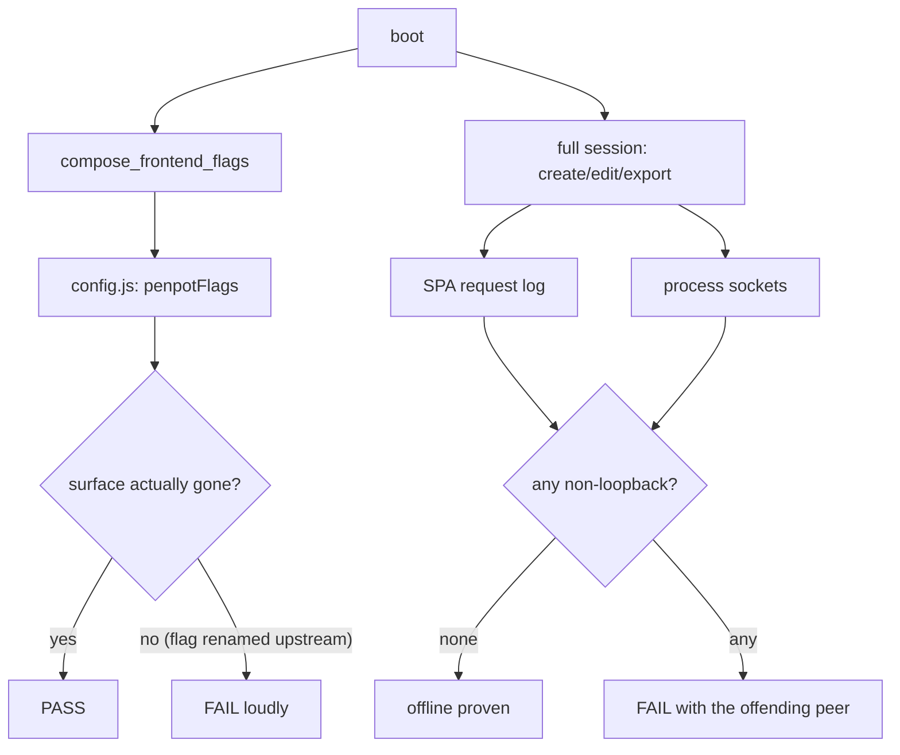

# D1 — Offline & Config Hardening Implementation Plan

> **For agentic workers:** REQUIRED SUB-SKILL: Use superpowers:subagent-driven-development (recommended) or superpowers:executing-plans to implement this plan task-by-task. Steps use checkbox (`- [ ]`) syntax for tracking.

**Goal:** Delete every cloud surface Penpot's own flags can remove, and turn "works entirely on your machine" from a claim in the README into a test that fails if a single packet tries to leave.

**Architecture:** Three independent pieces. (1) A reusable **capture harness** (`scripts/shots.sh`) drives the bundled offline Chromium over a named list of web surfaces at a fixed viewport — built FIRST so the **"before" baseline** is captured while the cloud surfaces still exist. (2) **Flags** are appended to the frontend `penpotFlags` string only (mirroring E7's `PLUGINS_FRONTEND_FLAG` precedent), leaving the backend untouched. (3) A two-sided **egress observer** proves offline: Chromium's request log catches what the SPA reaches for, and a process-level socket check catches what the native processes (JVM, exporter) reach for — neither alone is sufficient.

**Tech Stack:** Rust (`apps/desktop/src/lib.rs` flag composition), bundled Playwright Chromium (`runtime/exporter/node_modules/playwright`), bash + stdlib Python 3, `lsof`.

## Global Constraints

- **A flag that is SET is not a flag that WORKED.** PLAN4 risk 4: flag names are upstream-owned and can be renamed or removed between Penpot versions. Every flag assertion must prove the surface actually changed behaviourally — never merely that the token appears in `config.js`. A set-but-ignored flag must turn the gate RED, not leave it green while the experience silently degrades.
- **"Offline" means zero NON-LOOPBACK connection attempts.** Traffic to our own supervised stack on `localhost`/`127.0.0.1`/`[::1]` is the entire architecture and is permitted. What must never happen is a connection leaving the machine.
- **Invariant 3 — the SPA stays byte-untouched.** No serve-time patching of upstream JS/CSS, no injected scripts; only URLs and configuration reach the canvas. Nothing under `runtime/frontend/` may be modified. Setting Penpot's own documented flags is *configuration*, not patching.
- **Dedicated ports (verified unused):** proxy `9046`, backend `6508`, postgres `5581`, valkey `6524`, control `9047`.
- **Teardown strictly PID-scoped.** Kill only PIDs this gate recorded. Never `pkill`/`killall` by name — sibling gates run on other port blocks.
- **D1 lands product code, so its gate IS chained into `just e2e`** (build precedent E1–E4/E7), unlike the D0 pure-verdict spike.
- Screenshot hygiene: fixed **1280px-wide** viewport, PNGs written under `docs/milestones/d<N>/img/`.
- **No OS permissions needed for D1** — every capture is a web surface via Chromium. The Screen-Recording/Accessibility requirement begins at D3, when native chrome exists.
- No bare `#<number>` in GitHub-rendered text (commit messages, docs) unless referencing a real PR/issue — GitHub autolinks it. Hash routes go in backticks.
- Commit messages end with: `Co-Authored-By: Claude Fable 5 <noreply@anthropic.com>`

---

## File Structure

| File | Responsibility |
|---|---|
| `scripts/shots.sh` *(new)* | Reusable capture harness. Boots nothing itself — takes a `BASE` of a running stack, drives Chromium over a named surface list at a fixed viewport, writes PNGs to a given out-dir. Used by D1 and every later milestone. |
| `scripts/shots_capture.cjs` *(new)* | The Chromium driver `shots.sh` calls. One responsibility: navigate + screenshot, deterministically. |
| `docs/milestones/d1/img/` *(new)* | The before/after PNGs. |
| `apps/desktop/src/lib.rs` *(modify)* | Add the D1 cloud-surface flags to `compose_frontend_flags` (frontend string only; backend `DEFAULT_PENPOT_FLAGS` untouched). |
| `scripts/d1_egress.py` *(new)* | The process-level socket observer: given a PID set, report every non-loopback peer. Pure and unit-testable on synthetic `lsof` output. |
| `scripts/d1_surfaces.cjs` *(new)* | Behavioural flag assertions + the SPA-side request log: did the surface actually disappear, and did the SPA reach off-machine? |
| `scripts/d1-offline.sh` *(new)* | The gate: boots the stack on D1 ports, runs the flag/surface/egress assertions, tears down PID-scoped. |
| `justfile` *(modify)* | Add `d1` recipe **and** chain `scripts/d1-offline.sh` into `e2e`. |
| `docs/milestones/d1.md` *(new)* | What changed / how it works (Mermaid) / before-after visuals / known limits. |

---

### Task 1: The capture harness (`scripts/shots.sh`)

**Files:**
- Create: `scripts/shots.sh`
- Create: `scripts/shots_capture.cjs`

**Interfaces:**
- Produces: `BASE=<url> OUT_DIR=<dir> bash scripts/shots.sh <surface>...` where each `<surface>` is `name=path` (e.g. `home=/__home`). Writes `<OUT_DIR>/<name>.png` at a 1280×800 viewport and prints one line per capture. Exits non-zero if any capture fails.

- [ ] **Step 1: Write the Chromium driver**

Create `scripts/shots_capture.cjs`:

```javascript
/**
 * Deterministic web-surface capture for milestone docs (PLAN4 "Definition of
 * done"). Drives the BUNDLED offline chromium — same module resolution as
 * scripts/routes_gate_nav.cjs. Read-only: navigates and screenshots, never
 * mutates the page. Fixed viewport so re-runs are comparable, which is what
 * makes honest before/after possible.
 *
 * argv: <base> <outDir> <name=path> [<name=path> ...]
 */
const path = require("path");
const REPO = process.env.REPO_ROOT || process.cwd();
const PW = process.env.PLAYWRIGHT_MODULE ||
  path.join(REPO, "runtime/exporter/node_modules/playwright");
const { chromium } = require(PW);

const VIEWPORT = { width: 1280, height: 800 };
const SETTLE_MS = Number(process.env.SHOTS_SETTLE_MS || 3500);

(async () => {
  const [base, outDir, ...pairs] = process.argv.slice(2);
  if (!base || !outDir || pairs.length === 0) {
    console.error("usage: shots_capture.cjs <base> <outDir> <name=path>...");
    process.exit(2);
  }
  const browser = await chromium.launch({ headless: true });
  let failed = 0;
  try {
    const page = await browser.newPage({ viewport: VIEWPORT });
    // Auto-login once so authenticated surfaces render.
    await page.goto(`${base}/__bootstrap`, { waitUntil: "domcontentloaded" });
    await page.waitForTimeout(SETTLE_MS);

    for (const pair of pairs) {
      const idx = pair.indexOf("=");
      const name = pair.slice(0, idx);
      const rel = pair.slice(idx + 1);
      const file = path.join(outDir, `${name}.png`);
      try {
        await page.goto(`${base}${rel}`, { waitUntil: "domcontentloaded" });
        await page.waitForTimeout(SETTLE_MS);
        await page.screenshot({ path: file });
        console.log(`captured ${name} <- ${rel}`);
      } catch (e) {
        console.error(`FAILED ${name} <- ${rel}: ${e}`);
        failed++;
      }
    }
  } finally {
    await browser.close();
  }
  process.exit(failed === 0 ? 0 : 1);
})();
```

- [ ] **Step 2: Write the wrapper**

Create `scripts/shots.sh`:

```bash
#!/usr/bin/env bash
# Reusable web-surface capture for milestone docs (PLAN4 "Definition of done").
#
# Captures our own /__ pages AND Penpot's SPA surfaces at a FIXED 1280px-wide
# viewport into a given out-dir, driving the bundled offline chromium. It boots
# NOTHING — point it at an already-running stack, so a gate can capture mid-run.
#
# NOTE (PLAN4 honest split): this covers WEB surfaces only. Native chrome
# (menu bar, Preferences window, native dialogs) is outside any browser and is
# captured manually from D3 onward; that part is NOT CI-reproducible.
#
# usage: BASE=http://localhost:9046 OUT_DIR=docs/milestones/d1/img \
#          bash scripts/shots.sh home=/__home dashboard=/
set -u

ROOT="$(cd "$(dirname "${BASH_SOURCE[0]}")/.." && pwd)"
export REPO_ROOT="$ROOT"
BASE="${BASE:?set BASE to a running stack, e.g. http://localhost:9046}"
OUT_DIR="${OUT_DIR:?set OUT_DIR, e.g. docs/milestones/d1/img}"

if [ "$#" -eq 0 ]; then
    echo "usage: BASE=.. OUT_DIR=.. $0 <name=path> [<name=path> ...]" >&2
    exit 2
fi

mkdir -p "$OUT_DIR"
node "$ROOT/scripts/shots_capture.cjs" "$BASE" "$OUT_DIR" "$@"
```

- [ ] **Step 3: Verify both parse**

Run: `chmod +x scripts/shots.sh && node --check scripts/shots_capture.cjs && bash -n scripts/shots.sh && echo "syntax OK"`
Expected: `syntax OK`

- [ ] **Step 4: Commit**

```bash
git add scripts/shots.sh scripts/shots_capture.cjs
git commit -m "$(cat <<'EOF'
D1: reusable web-surface capture harness for milestone docs

Fixed 1280px viewport + a named surface list so re-runs are comparable, which
is what makes honest before/after possible. Boots nothing — points at a running
stack so a gate can capture mid-run. Web surfaces only; native chrome is
captured manually from D3 and is not CI-reproducible.

Co-Authored-By: Claude Fable 5 <noreply@anthropic.com>
EOF
)"
```

---

### Task 2: Capture the "before" baseline — BEFORE any flag lands

**Files:**
- Create: `docs/milestones/d1/img/before-*.png`

**Interfaces:**
- Consumes: `scripts/shots.sh` (Task 1).
- Produces: committed baseline PNGs of the cloud surfaces **as they exist today**.

**Why this task is ordered here:** once Task 3 lands the flags, these surfaces are gone. If the baseline is not captured now, D1's before/after has nothing to compare and the milestone doc becomes an assertion instead of evidence.

- [ ] **Step 1: Boot a stack on the D1 ports**

Run the app headless against the D1 port block. Use the same boot approach the sibling gates use (see `scripts/e7-plugins-spike.sh` for the pattern: env-configured ports, fresh `mktemp` data/vault dirs, pg-install cache seeded). Wait until the proxy answers.

Verify: `curl -fsS -o /dev/null -w '%{http_code}\n' http://localhost:9046/` → `200`

- [ ] **Step 2: Capture the cloud surfaces**

```bash
BASE=http://localhost:9046 OUT_DIR=docs/milestones/d1/img \
  bash scripts/shots.sh \
    before-dashboard=/ \
    before-settings=/#/settings/profile \
    before-auth=/#/auth/login
```
Expected: three `captured …` lines, exit 0, three PNGs on disk.

- [ ] **Step 3: Confirm the images are real**

Run: `ls -l docs/milestones/d1/img/ && file docs/milestones/d1/img/before-dashboard.png`
Expected: three non-trivial PNGs (a few hundred KB each, not 0 bytes). If any is suspiciously tiny, the surface did not render — increase `SHOTS_SETTLE_MS` and recapture rather than committing a blank.

- [ ] **Step 4: Tear the stack down (PID-scoped) and commit**

```bash
git add docs/milestones/d1/img
git commit -m "$(cat <<'EOF'
D1: capture the cloud-surface baseline before the flags remove it

The dashboard, account settings and login screens as they exist TODAY. Once the
D1 flags land these are gone, so without this the milestone's before/after would
be an assertion rather than evidence.

Co-Authored-By: Claude Fable 5 <noreply@anthropic.com>
EOF
)"
```

---

### Task 3: The cloud-surface flags

**Files:**
- Modify: `apps/desktop/src/lib.rs`

**Interfaces:**
- Consumes: `supervisor::DEFAULT_PENPOT_FLAGS`, existing `compose_frontend_flags(extra: Option<&str>) -> String`.
- Produces: `compose_frontend_flags` output now additionally contains `disable-registration disable-dashboard-templates-section disable-google-fonts-provider`. Backend `DEFAULT_PENPOT_FLAGS` is UNCHANGED.

**Design note the implementer must respect:** append to the FRONTEND string only, mirroring E7's `PLUGINS_FRONTEND_FLAG` precedent. These are UI surfaces; the backend flag string drives the JVM and is deliberately left alone to keep the blast radius small. `disable-login-with-password` is NOT included here — Task 4 audits it first, because our `/__bootstrap` auto-login uses a password.

- [ ] **Step 1: Write the failing test**

Add to the `#[cfg(test)] mod tests` block in `apps/desktop/src/lib.rs`:

```rust
    #[test]
    fn frontend_flags_disable_every_cloud_surface() {
        let flags = compose_frontend_flags(None);
        for expected in [
            "disable-registration",
            "disable-dashboard-templates-section",
            "disable-google-fonts-provider",
        ] {
            assert!(flags.contains(expected), "missing {expected} in {flags}");
        }
        // The plugins flag (E7) must survive the addition.
        assert!(flags.contains("enable-plugins"), "E7 plugins flag lost");
        // login-with-password is deliberately NOT disabled here — the
        // /__bootstrap auto-login uses a password (audited in D1 task 4).
        assert!(
            !flags.contains("disable-login-with-password"),
            "login-with-password must not be disabled without the bootstrap audit"
        );
    }

    #[test]
    fn backend_flags_are_left_alone_by_the_frontend_composition() {
        // The cloud-surface flags are UI-only; the JVM's flag string must not
        // silently acquire them.
        assert!(!supervisor::DEFAULT_PENPOT_FLAGS.contains("disable-registration"));
    }
```

- [ ] **Step 2: Run to verify it fails**

Run: `cargo test -p penpot-desktop frontend_flags_disable_every_cloud_surface`
Expected: FAIL — `missing disable-registration in ...`

- [ ] **Step 3: Implement**

In `apps/desktop/src/lib.rs`, next to `PLUGINS_FRONTEND_FLAG`, add:

```rust
/// D1 — cloud surfaces Penpot's OWN flags can delete. Appended to the frontend
/// `penpotFlags` string only; the backend `PENPOT_FLAGS` is deliberately
/// untouched (these are UI surfaces, and a smaller blast radius is worth more
/// than defence-in-depth we cannot test here).
///
/// Why each one, for an offline single-user app with no account:
///   * `disable-registration` — there is nobody to register.
///   * `disable-dashboard-templates-section` — links to cloud-hosted content.
///   * `disable-google-fonts-provider` — a live network dependency; removing it
///     is load-bearing for the zero-egress guarantee, not cosmetic.
///
/// NOT included: `disable-login-with-password`. Our `/__bootstrap` auto-login
/// signs in with a password, so disabling it could break boot; D1 audits that
/// live before anyone adds it here.
const D1_CLOUD_SURFACE_FLAGS: &str =
    "disable-registration disable-dashboard-templates-section disable-google-fonts-provider";
```

Then extend the composition:

```rust
fn compose_frontend_flags(extra: Option<&str>) -> String {
    let mut flags = format!(
        "{} {} {}",
        supervisor::DEFAULT_PENPOT_FLAGS,
        PLUGINS_FRONTEND_FLAG,
        D1_CLOUD_SURFACE_FLAGS
    );
    if let Some(extra) = extra.map(str::trim).filter(|s| !s.is_empty()) {
        flags.push(' ');
        flags.push_str(extra);
    }
    flags
}
```

- [ ] **Step 4: Run the tests**

Run: `cargo test -p penpot-desktop compose_frontend_flags frontend_flags backend_flags`
Expected: PASS. Also run the pre-existing config.js render test — it asserts an exact string and WILL need updating:
Run: `cargo test -p penpot-desktop --lib` and fix any expected-string assertion that now includes the new flags (update the expectation; do not weaken the assertion to a `contains`).

- [ ] **Step 5: Commit**

```bash
git add apps/desktop/src/lib.rs
git commit -m "$(cat <<'EOF'
D1: disable the cloud surfaces Penpot's own flags can delete

Registration, the dashboard's cloud templates section, and the Google-fonts
provider — the last is load-bearing for the zero-egress guarantee, not
cosmetic. Frontend penpotFlags string only; the backend flags are untouched.
login-with-password is deliberately excluded pending the bootstrap audit.

Co-Authored-By: Claude Fable 5 <noreply@anthropic.com>
EOF
)"
```

---

### Task 4: Audit `login-with-password` against `/__bootstrap`

**Files:**
- Create: `.superpowers/sdd/d1-login-audit.md` (evidence only — not committed to the repo tree; record findings in the milestone doc)

**Interfaces:**
- Produces: a documented decision — either `disable-login-with-password` is added to `D1_CLOUD_SURFACE_FLAGS` (with evidence that boot still works), or it is explicitly rejected with the captured failure.

**Why:** `/__bootstrap` auto-logs-in with a password. If that flag disables the password grant, boot breaks. PLAN4 requires auditing it *before* disabling. Do not skip this and do not add the flag on a hunch.

- [ ] **Step 1: Boot with the flag added via the env override**

The app already supports appending frontend flags without a code change:

```bash
PENPOT_LOCAL_EXTRA_FRONTEND_FLAGS="disable-login-with-password" \
  ./target/debug/penpot-desktop
```
(Use the D1 port block and a fresh data dir, as in Task 2.)

- [ ] **Step 2: Observe whether boot completes**

Wait for readiness, then check:
```bash
curl -fsS -o /dev/null -w '%{http_code}\n' http://localhost:9046/
```
Expected: `200` if boot survived. Also confirm the app reached an authenticated state (the bootstrap route consumed) rather than sitting on a login screen.

- [ ] **Step 3: Record the decision with evidence**

- If boot SURVIVED: add `disable-login-with-password` to `D1_CLOUD_SURFACE_FLAGS` in `apps/desktop/src/lib.rs`, update the Task 3 test that asserts its absence (invert it), and note the evidence.
- If boot BROKE: leave the flag out, and record the captured failure verbatim. This is a legitimate outcome — the login UI stays reachable, which is a documented known limit rather than a defect.

- [ ] **Step 4: Commit whichever outcome occurred**

```bash
git add -A
git commit -m "$(cat <<'EOF'
D1: audit login-with-password against the bootstrap auto-login

Our /__bootstrap signs in with a password, so this flag could break boot. The
decision is recorded with live evidence rather than assumed either way.

Co-Authored-By: Claude Fable 5 <noreply@anthropic.com>
EOF
)"
```

---

### Task 5: The egress observer (two-sided)

**Files:**
- Create: `scripts/d1_egress.py`
- Create: `scripts/d1_surfaces.cjs`

**Interfaces:**
- Produces:
  - `python3 scripts/d1_egress.py parse <lsof_output_file>` → JSON `{"connections": [...], "nonLoopback": [...]}`; a peer is loopback iff its host is `127.0.0.1`, `::1`, `localhost`, or `*`.
  - `python3 scripts/d1_egress.py selftest` → `selftest OK`.
  - `BASE=<url> node scripts/d1_surfaces.cjs` → one JSON line `{"ok":bool,"requests":[url],"nonLoopbackRequests":[url],"registrationGone":bool,"templatesSectionGone":bool}`.

**Why two observers:** Chromium's request log sees what the SPA reaches for (Google fonts, telemetry, avatars); the socket check sees what the native processes (JVM, exporter, our Rust app) reach for. Neither alone proves offline.

- [ ] **Step 1: Write the failing selftest for the socket parser**

Create `scripts/d1_egress.py`:

```python
#!/usr/bin/env python3
"""D1: process-level egress observer.

Parses `lsof -nP -i` output and separates loopback peers (our own supervised
stack — the whole architecture) from anything leaving the machine (forbidden).
Pure text processing so it is unit-testable without opening a socket.
"""
import json
import re
import sys

LOOPBACK_HOSTS = {"127.0.0.1", "::1", "localhost", "*", ""}

# lsof NAME column looks like: 127.0.0.1:6508->127.0.0.1:54321 (ESTABLISHED)
#                          or  [::1]:5581 (LISTEN)
PEER_RE = re.compile(r"->\[?([^\]\s]+?)\]?:(\d+)")


def _host_is_loopback(host):
    return host in LOOPBACK_HOSTS or host.startswith("127.")


def parse(text):
    """Every outbound peer seen, split into loopback and non-loopback."""
    conns, bad = [], []
    for line in text.splitlines():
        m = PEER_RE.search(line)
        if not m:
            continue
        host, port = m.group(1), m.group(2)
        entry = {"host": host, "port": int(port)}
        conns.append(entry)
        if not _host_is_loopback(host):
            bad.append(entry)
    return {"connections": conns, "nonLoopback": bad}


def _selftest():
    sample = "\n".join([
        "java 123 u IPv4 TCP 127.0.0.1:6508->127.0.0.1:54321 (ESTABLISHED)",
        "java 123 u IPv6 TCP [::1]:5581 (LISTEN)",
        "penpot 456 u IPv4 TCP 192.168.1.9:53344->142.250.1.1:443 (ESTABLISHED)",
    ])
    out = parse(sample)
    assert len(out["connections"]) == 2, out
    assert out["nonLoopback"] == [{"host": "142.250.1.1", "port": 443}], out
    assert parse("")["nonLoopback"] == []
    print("selftest OK")


if __name__ == "__main__":
    if len(sys.argv) == 2 and sys.argv[1] == "selftest":
        _selftest()
    elif len(sys.argv) == 3 and sys.argv[1] == "parse":
        with open(sys.argv[2], "r", encoding="utf-8") as fh:
            print(json.dumps(parse(fh.read())))
    else:
        print("usage: d1_egress.py selftest | parse <lsof_output>", file=sys.stderr)
        sys.exit(2)
```

- [ ] **Step 2: Run the selftest**

Run: `chmod +x scripts/d1_egress.py && python3 scripts/d1_egress.py selftest`
Expected: `selftest OK`

- [ ] **Step 3: Write the SPA-side observer + behavioural flag assertions**

Create `scripts/d1_surfaces.cjs`:

```javascript
/**
 * D1: SPA-side egress log + BEHAVIOURAL flag assertions.
 *
 * A flag that is SET is not a flag that WORKED (PLAN4 risk 4) — upstream can
 * rename a flag and leave our gate green while the surface quietly returns.
 * So this checks the SURFACES, not the config string, and simultaneously
 * records every request the SPA makes so off-machine egress is caught.
 *
 * Read-only: navigates and observes. Nothing is injected into the SPA.
 */
const path = require("path");
const REPO = process.env.REPO_ROOT || process.cwd();
const PW = process.env.PLAYWRIGHT_MODULE ||
  path.join(REPO, "runtime/exporter/node_modules/playwright");
const { chromium } = require(PW);

const BASE = process.env.BASE || "http://localhost:9046";
const SETTLE = Number(process.env.SHOTS_SETTLE_MS || 3500);

function isLoopback(u) {
  try {
    const h = new URL(u).hostname;
    return h === "localhost" || h === "127.0.0.1" || h === "::1" || h.startsWith("127.");
  } catch {
    return true; // data:, blob:, about: — never leave the machine
  }
}

(async () => {
  const browser = await chromium.launch({ headless: true });
  const requests = [];
  try {
    const page = await browser.newPage({ viewport: { width: 1280, height: 800 } });
    page.on("request", (r) => requests.push(r.url()));

    await page.goto(`${BASE}/__bootstrap`, { waitUntil: "domcontentloaded" });
    await page.waitForTimeout(SETTLE);

    // Behavioural: the registration surface must not render a signup form.
    await page.goto(`${BASE}/#/auth/register`, { waitUntil: "domcontentloaded" });
    await page.waitForTimeout(SETTLE);
    const registrationGone =
      (await page.$$eval("input[name='password'], input[type='password']", (e) => e.length)) === 0 ||
      (await page.$$eval("form", (els) =>
        els.every((f) => !/register|sign\s*up/i.test(f.textContent || "")))); 

    // Behavioural: the dashboard must not show the cloud templates section.
    await page.goto(`${BASE}/`, { waitUntil: "domcontentloaded" });
    await page.waitForTimeout(SETTLE);
    const templatesSectionGone = (await page.$$eval("*", (els) =>
      !els.some((e) => /templates/i.test((e.textContent || "").slice(0, 200)) &&
                        e.children.length === 0)));

    const nonLoopbackRequests = [...new Set(requests.filter((u) => !isLoopback(u)))];
    console.log(JSON.stringify({
      ok: true,
      requests: [...new Set(requests)].length,
      nonLoopbackRequests,
      registrationGone,
      templatesSectionGone,
    }));
  } catch (e) {
    console.log(JSON.stringify({ ok: false, error: String(e) }));
  } finally {
    await browser.close();
  }
})();
```

- [ ] **Step 4: Verify it parses**

Run: `node --check scripts/d1_surfaces.cjs && echo "syntax OK"`
Expected: `syntax OK`

- [ ] **Step 5: Commit**

```bash
git add scripts/d1_egress.py scripts/d1_surfaces.cjs
git commit -m "$(cat <<'EOF'
D1: two-sided egress observer + behavioural flag assertions

Chromium's request log sees what the SPA reaches for; the lsof parser sees what
the native processes reach for. Neither alone proves offline. Flags are checked
by whether the SURFACE disappeared, never by whether the token is in config.js —
a renamed upstream flag must turn the gate red, not leave it green.

Co-Authored-By: Claude Fable 5 <noreply@anthropic.com>
EOF
)"
```

---

### Task 6: The gate

**Files:**
- Create: `scripts/d1-offline.sh`
- Modify: `justfile`

**Interfaces:**
- Consumes: Tasks 1, 3, 5.
- Produces: `bash scripts/d1-offline.sh` → `D1 OFFLINE: ALL PASS`, exit 0.

- [ ] **Step 1: Write the gate**

Create `scripts/d1-offline.sh`. Copy the boot/teardown scaffold from `scripts/e7-plugins-spike.sh` (ports, `mktemp` dirs, pg-cache seeding, PID-scoped teardown, `pass`/`fail` helpers, ANSI-stripped log greps, dirs kept on failure), adapt to the D1 port block, then assert:

```bash
# (a) FLAGS SERVED — necessary but NOT sufficient on its own.
CONFIG=$(curl -fsS "$BASE/js/config.js")
for f in disable-registration disable-dashboard-templates-section disable-google-fonts-provider; do
    if echo "$CONFIG" | grep -q -- "$f"; then
        pass "(a/served) config.js carries $f"
    else
        fail "(a/served) config.js is MISSING $f"
    fi
done

# (b) FLAGS TOOK EFFECT — the assertion that actually matters. A renamed
#     upstream flag would still be "served" while the surface came back.
SURF=$(BASE="$BASE" node "$ROOT/scripts/d1_surfaces.cjs")
echo "     surfaces: $SURF"
for key in registrationGone templatesSectionGone; do
    v=$(echo "$SURF" | python3 -c "import json,sys;print(json.load(sys.stdin).get('$key'))")
    if [ "$v" = "True" ]; then
        pass "(b/effect) $key — the surface is actually gone, not just flagged"
    else
        fail "(b/effect) $key is False — the flag was SET but did NOT take effect"
    fi
done

# (c) ZERO NON-LOOPBACK EGRESS, both sides.
SPA_BAD=$(echo "$SURF" | python3 -c "import json,sys;print(len(json.load(sys.stdin).get('nonLoopbackRequests',[])))")
if [ "$SPA_BAD" = "0" ]; then
    pass "(c/spa) the SPA made ZERO non-loopback requests"
else
    fail "(c/spa) the SPA attempted $SPA_BAD non-loopback request(s): $(echo "$SURF" | python3 -c "import json,sys;print(json.load(sys.stdin)['nonLoopbackRequests'])")"
fi

lsof -nP -i -a -p "$(pgrep -P "$APP_PID" | tr '\n' ',' | sed 's/,$//'),$APP_PID" > "$WORK_DIR/lsof.txt" 2>/dev/null || true
EG=$(python3 "$ROOT/scripts/d1_egress.py" parse "$WORK_DIR/lsof.txt")
PROC_BAD=$(echo "$EG" | python3 -c "import json,sys;print(len(json.load(sys.stdin)['nonLoopback']))")
if [ "$PROC_BAD" = "0" ]; then
    pass "(c/proc) no supervised process holds a non-loopback connection"
else
    fail "(c/proc) non-loopback connection(s): $(echo "$EG" | python3 -c "import json,sys;print(json.load(sys.stdin)['nonLoopback'])")"
fi
```

State in the script header that the socket check **samples** — a very short-lived connection between polls could be missed — so it is a strong signal, not a proof of absence. Run the exercise (create a file, edit, export) BEFORE sampling so the session is realistic.

- [ ] **Step 2: Add the recipe AND chain it into e2e**

In `justfile`, after the `d0` recipe:

```make
# D1 offline + config hardening (PLAN4 milestone D1). Sets every Penpot flag
# that deletes a cloud surface (registration, the dashboard's cloud templates
# section, the Google-fonts provider) and proves the offline promise: the flags
# are SERVED, they actually TOOK EFFECT (the surface is gone — a renamed
# upstream flag must turn this red, not leave it green), and a full session
# makes ZERO non-loopback connections, checked on BOTH sides (the SPA's request
# log and the supervised processes' sockets). Dedicated ports
# 9046/6508/5581/6524 (control 9047). Chained into `just e2e` — D1 lands
# product code, unlike the D0 spike.
d1:
    bash scripts/d1-offline.sh
```

And add to the `e2e` recipe body, after `bash scripts/e7-plugins-spike.sh`:

```make
    bash scripts/d1-offline.sh
```

- [ ] **Step 3: Run the gate twice**

Run: `bash scripts/d1-offline.sh` (twice)
Expected: `D1 OFFLINE: ALL PASS` both times, all D1 ports freed.

**If (b) fails:** that is the plan working as designed, not a bug in your code — it means the flag name is wrong or upstream ignores it. Record which flag failed, remove it from `D1_CLOUD_SURFACE_FLAGS`, and note it in the milestone doc as a surface Penpot's flags cannot remove. Do NOT weaken the assertion to make it pass.

- [ ] **Step 4: Commit**

```bash
git add scripts/d1-offline.sh justfile
git commit -m "$(cat <<'EOF'
D1: the offline + config-hardening gate (chained into e2e)

Asserts flags are served, that they actually took effect behaviourally, and
that a full session makes zero non-loopback connections on both the SPA and
process sides. The socket check samples, so it is a strong signal rather than
a proof of absence — stated in the script header.

Co-Authored-By: Claude Fable 5 <noreply@anthropic.com>
EOF
)"
```

---

### Task 7: After-capture and the milestone doc

**Files:**
- Create: `docs/milestones/d1/img/after-*.png`
- Create: `docs/milestones/d1.md`

- [ ] **Step 1: Capture the "after" surfaces**

With a stack running on the D1 ports (flags now active):

```bash
BASE=http://localhost:9046 OUT_DIR=docs/milestones/d1/img \
  bash scripts/shots.sh \
    after-dashboard=/ \
    after-settings=/#/settings/profile \
    after-auth=/#/auth/register
```

- [ ] **Step 2: Write the milestone doc**

Create `docs/milestones/d1.md` with PLAN4's four required sections. Include this diagram:

````markdown

````

**Known limits** must state: the socket check samples and cannot prove absence of a very short-lived connection; the flags are frontend-only so the backend RPCs still exist (unreachable offline, but present); and any flag that failed its effect assertion, named explicitly.

- [ ] **Step 3: Commit**

```bash
git add docs/milestones/d1 docs/milestones/d1.md
git commit -m "$(cat <<'EOF'
D1: after-capture and the milestone doc

Before/after of the cloud surfaces, plus the honest limits: the socket check
samples rather than proving absence, and the flags are frontend-only.

Co-Authored-By: Claude Fable 5 <noreply@anthropic.com>
EOF
)"
```

---

## Self-Review

**Spec coverage (PLAN4 D1 exit criteria):**
- "set every Penpot flag that deletes a cloud surface" → Task 3. ✓
- "audit `login-with-password` against the `/__bootstrap` path before disabling" → Task 4, with both outcomes made legitimate. ✓
- "build `scripts/shots.sh`" → Task 1. ✓
- "capture the **before** baseline while they still exist" → Task 2, deliberately ordered before Task 3. ✓
- "(a) each flag is served in `config.js`" → gate leg (a). ✓
- "AND actually took effect in the SPA (not merely that we set it)" → gate leg (b), behavioural, with an explicit instruction NOT to weaken it. ✓
- "(b) the corresponding surfaces are absent" → same leg (b). ✓
- "(c) zero non-loopback connection attempts across a full session" → gate leg (c), two-sided. ✓
- "chained into `just e2e`" → Task 6 Step 2. ✓
- milestone doc with narrative + visuals + known limits → Task 7. ✓

**Placeholder scan:** none. Task 6 Step 1 references `scripts/e7-plugins-spike.sh` as the scaffold — a concrete existing file — and gives the assertion body in full; `APP_PID`, `BASE`, `WORK_DIR`, `ROOT` come from that scaffold.

**Type consistency:** `parse()` / `selftest` / `parse <file>` argv shapes match between `d1_egress.py` and the gate. `d1_surfaces.cjs`'s keys (`nonLoopbackRequests`, `registrationGone`, `templatesSectionGone`) match the gate's lookups exactly. `compose_frontend_flags(Option<&str>) -> String` is unchanged in signature.

**Known weakness the implementer must not paper over:** the two behavioural checks in `d1_surfaces.cjs` are DOM heuristics (looking for a signup form, looking for a "templates" label). If a heuristic returns a false "gone", the gate would pass while the surface is still present — the exact failure D1 exists to prevent. Task 6 Step 3 therefore requires eyeballing the `after-*` screenshots from Task 7 against the heuristic's verdict at least once; if they disagree, trust the screenshot and fix the heuristic.
